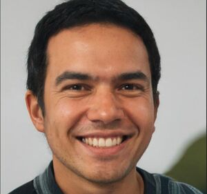
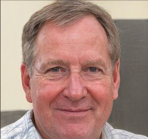

## Introdução

Personas são personagens fictícios, arquétipo hipotético de um grupo de usuários reais, sendo criada para poder descrever um usuário típico. Seu objetivo é representar um grupo de usuários finais, representando como ele se comporta, como pensa, seus objetivos e suas motivações.

Elas são uma ferramenta que pode se apresentar em mais de uma fase de um projeto, sendo uma ferramenta muito importante tanto na questão de elicitação de requisitos como na questão de decisões de design. Desse modo faz com que todos fiquem focados no mesmo alvo.

## Metodologia

Personas são definidas a partir do momento que se realiza um estudo de campo para descobrir quais as características dos usuários do produto, tendo esses dados em mão, são criadas as personas se referenciando neles, sendo que cada um apresenta características significativas.

Isso faz com que não se tenha um usuário elástico, a partir do momento que uma persona perde essa elasticidade, é possível identificar suas habilidades, motivações e o que ela quer alcançar, tornando claro os objetivos dos usuários para que se possa ver o que o produto deve fazer ou pode deixar de fazer.

Elas serão usadas mais para frente no projeto, podendo aparecer na parte de elicitação e validação de alguns artefatos, sendo que para serem utilizadas é feito a partir do método de encenação.

## Elenco de Personas

Tendo em vista a fala de Courage e Baxter sobre a quantidade do elenco de personas, foram definidos que o projeto possuiria uma quantidade de 4 personas, sendo 1 primária, 2 secundárias e 1 antipersona. Essa quantidade foi escolhida para se ter personas significativas, memoráveis e que representasse bem os usuários e suas características, pois foi identificado que alguns usuários usam mais uma tarefa do que outros, então essa quantidade irá satisfazer as necessidades de se ter um grupo típicos de usuários.

O objetivo das Personas é que se tenha bem em mente para quem o software foi projetado e para quem não foi, por isso, para a construção dessas personas, foram baseadas nos dados levantados pelos usuários, através de um formulário online.

Para gerar cada imagem de persona foi usada a ferramenta This Person Doest Not Exist.

Elas podem ser vistas na seguinte ordem:

Tabela 1 - Persona 1 | Persona Primária 
Tabela 2 - Persona 2 | Persona Secundária 
Tabela 3 - Persona 3 | Persona Secundária 
Tabela 4 - Persona 4 | Antipersona

## Montagem das Personas

Tendo sido realizado o formulário online, foram adquiridos vários dados de tipos de usuários diferentes, tendo isso mente foram feitas algumas conclusões do usuário padrão do site, tendo em mente os dados do formulário que foi aplicado para o pública do Brasil e outro dentro da comunidade de fora do país, e foram a partir delas que as características das personas foram formadas. Todo esse processo de análise e conclusão pode ser encontrado no link: [Perfil de Usuário](perfil_usuario.md)

Com essa conclusão temos as seguintes características definidas para as personas:

* A faixa de idade das personas oscila dentro do que foi levantado pelos usuários, sendo entre 18 e 30.
* As personas que moram no Centro - Oeste do país. Uma vez que nos dados se tem que os usuários moram no Centro - Oeste.
* As personas tem algum tipo de envolvimento com faculdade, já que no perfil de usuários eles apresentam pelo menos o ensino superior incompleto.
* As personas utilizam o site para ver rotas e pontos de referência.

Com essas caracteŕisticas definidas, se motou as quatro personas.

É importante ressaltar que há dados de pessoas que não estão nessa faixa de idade ou que apresentam algumas outras características, sendo que não foi montado personas representativas para elas, uma vez que esses usuários apresentam-se em uma quantidade mínima, e por sua vez não representariam um típico usuário do site.

 

|          Persona          |          Primária          |
|:-------------------------:|:--------------------------:|
|           Nome            |    Lucas Oliveira Martins  |
|           Idade           |           27 Anos          |
|        Localização        |       Goiânia, Goiás       |
|            Foto           |    Imagem 1 - Lucas Oliveira Martins. (Fonte: This Person Does Not Exist)|
|           Status          |       Persona Primária     |
|         Objetivos         |Lucas deseja construir uma carreira de sucesso na área de logística e otimização de rotas. Ele quer aprender sobre mapeamento e georreferenciamento para aprimorar suas habilidades profissionais. Lucas que envelhecer com saúde e ter uma boa vida com sua namorada.|
|        Habilidades        |Lucas tem grande conhecimento em tecnologia e sistemas de informação geográfica. Ele sabe tocar alguns instrumentos musicais. Lucas tem habilidades em análise de dados geográficos.|
|          Tarefas          |Ele estuda de Manhã no curso de engenharia de software. Lucas faz estágio a tarde onde é responsável por planejar rotas para entregas de mercadorias. Ele faz academia de noite quando chega em casa. Lucas faz um passeio pelo menos uma vez no mês com sua namorada.|
|      Relacionamentos      |Namorada: Aline(25 Anos, Enfermeira). Pais: Cleiton(50 Anos, Zelador) e Francisca(52 Anos, Dona de Casa). Amigos da Faculdade: Pessoas que Lucas conheceu na Faculdade. Amigos do Trabalho: Grupo de pessoas com que Lucas trabalha|
|        Requisitos         |Lucas sabe bastante de tecnologia, mas as pessoas que trabalha não, por isso seus pensamentos são: "É importante ser intuitivo de usar para que o pessoal da minha empresa possa usar também facilitando meu trabalho de informar rotas para eles." "É importante que o OpenStreetMap ofereça uma interface de usuário rápida e responsiva, para que eu possa verificar as rotas de forma eficiente e sem atrasos." "Preciso de recursos de busca e navegação intuitivos no OpenStreetMap, para localizar rapidamente as áreas e estradas relevantes para o meu trabalho." "Gostaria de ter a opção de exportar as rotas validadas do OpenStreetMap em formatos compatíveis com os sistemas de gerenciamento de transporte da minha empresa."|
|        Expectativas       |Lucas espera encontrar uma interface que seja intuitiva. Ele espera que o site seja uma fonte confiável de dados geográficos atualizados. Lucas deseja que a comunidade seja ativa e envolvida, com usuários compartilhando conhecimento e experiências para melhorar o site.|

Tabela 1 - Persona: Lucas. (Fonte: Autor, 2023)

 

|          Persona          |         Secundária         |
|:-------------------------:|:--------------------------:|
|           Nome            |    Gabriel Souza Pereira   |
|           Idade           |           25 Anos          |
|        Localização        | Brasília, Distrito Federal |
|            Foto           |    Imagem 2 - Gabriel Souza Pereira. (Fonte: This Person Does Not Exist)|
|           Status          |     Persona Secundária     |
|         Objetivos         |Gabriel que poder caminhar com segurança sabendo sempre por onde está andando. Ele quer conhecer melhor sua vizinhança fazendo. Ele deseja manter uma vida saudável, caminhando e se alimentando bem. Gabriel se formou em Geografia e quer ser produtivo no seu recem trabalho como cartografo.|
|        Habilidades        |Gabriel tem grande conhecimento sobre relevos e solos. Ele sabe muito sobre tecnologia e utiliza bastante em seu trabalho. Gabriel tem habilidades de cozinha, pois um de seus passatempos é cozinhar.|
|          Tarefas          |Gabriel acorda de manhã para poder fazer sua caminhada matinal, as 6. Ele trabalha como cartografo, onde fica de 8 as 18, com pausa para o almoço. Gabriel tira o fim de semana para descobrir novos locais caminhando|
|      Relacionamentos      |Pais: Rose(45 anos, Dona de Casa), Carlos (47 anos, Frentista). Grupo de Amigos: Grupo formado pelos amigos de formatura da faculdade. Grupo do Trabalho: Grupo formado pelos seus colegas de trabalho.|
|        Requisitos         |Gabriel sabe bastante de tecnologia, e preza por ter acesso rápido e fácil a informação, seus pensamentos são: "Eu preciso de uma interface do OpenStreetMap fácil de usar e intuitiva para que eu possa usar as rotas e cadastrar novas e novos pontos de referência." "É importante que o site seja compatível com dispositivos móveis, pois muitas vezes estou apenas com meu celular." "Gostaria que as pessoas pudessem dar feedback das rotas que eu crio para saber se elas gostam."|
|        Expectativas       |Gabriel espera que o tempo de resposta do site seja rápido. Ele deseja que o aplicativo se atualize automaticamente conforme ele caminha. Gabriel gostaria de ser avisado quando entrar em uma área de risco marcada no site.|

Tabela 2 - Persona: Gabriel. (Fonte: Autor, 2023)

 

|          Persona          |         Secundária         |
|:-------------------------:|:--------------------------:|
|           Nome            |     Maria Costa Santos   |
|           Idade           |           23 Anos          |
|        Localização        | Brasília, Distrito Federal |
|            Foto           |    Imagem 3 - Maria Costa Santos. (Fonte: This Person Does Not Exist)|
|           Status          |      Persona Secundária    |
|         Objetivos         |Maria quer concluir sua graduação em Engenharia Civil e se estabelecer profissionalmente na área. Ela quer explorar sua nova cidade, conhecer pontos de referência e descobrir locais de interesse. Ela quer fazer novos amigos em sua nova cidade. Maria deseja se ambientar sem sua cidade para poder navegar sem auxílio de uma ferramente de mapa.|
|        Habilidades        |Maria possui habilidades avançadas em tecnologia, incluindo o uso de aplicativos de navegação e ferramentas de mapeamento. Ela está familiarizada com a utilização de smartphones com conhecimentos básicos de sistemas de informação geográfica. Mari conhece bastante de estruturas e de solos devido a sua graduação.|
|          Tarefas          |Maria trabalha de manhã como atendente de uma padaria. Ela faz a sua graduação no período da tarde. Ela usa o final de semana para poder realizar seu passatempo que é pintar. Maria faz todas as tarefas domesticas de sua casa já que mora sozinha.|
|      Relacionamentos      |Pais: Jose(55 Anos, Empreendedor), Marcela(53, Contadora). Grupo da Faculdade: Amigos que Maria conheceu na Faculdade. Grupo do Trabalho: Amigos que trabalham com ela na padaria.|
|        Requisitos         |Maria se mudou recentemente, então ela precisa conhecer melhor a sua cidade, por isso seus pensamentos são:  "Preciso de um site de mapeamento intuitivo e fácil de usar no meu smartphone, para que eu possa explorar a cidade e encontrar rotas para o trabalho e faculdade." "É importante que o OpenStreetMap forneça informações atualizadas e precisas sobre pontos de interesse, para que eu possa descobrir novos lugares." "Gostaria de poder personalizar minha experiência no OpenStreetMap, marcando meus lugares favoritos e adicionando anotações personalizadas para referência futura."|
|        Expectativas       |Maria espera que o OpenStreetMap seja uma plataforma confiável e abrangente, com informações atualizadas e relevantes sobre a cidade. Ela quer que o OpenStreetMap ofereça recursos de navegação eficientes, como cálculos de tempo de viagem e rotas alternativas. Ela espera que o OpenStreetMap a ajude a otimizar meu tempo de deslocamento para o trabalho e para a faculdade.|

Tabela 3 - Persona: Maria. (Fonte: Autor, 2023)

 

|          Persona          |        Antipersona         |
|:-------------------------:|:--------------------------:|
|           Nome            |      Carlos Jose Pereira   |
|           Idade           |           50 Anos          |
|        Localização        | Brasília, Distrito Federal |
|            Foto           |    Imagem 4 - Carlos Jose Pereira (Fonte: This Person Does Not Exist)|
|           Status          |      Antipersona    |
|         Objetivos         |Carlos deseja levar uma vida tranquila e descomplicada, evitando a exposição a tecnologia. Ele deseja desfrutar de seu tempo livre em atividades ao ar livre com sua família. Carlos deseja manter uma saúde boa para não precisar de ajuda de outras pessoas.|
|        Habilidades        |Carlos sabe bem pouco sobre tecnologia. Ele tem habilidade com atendimento, pois possui uma pequena lojinha em sua casa. Carlos sabe desenha, pois ele faz isso no seu tempo livre.|
|          Tarefas          |Carlos todo dia de manhã tem que tomar sua vitamina e seus remédios. Ele abre sua lojinha toda manhã e repõe o estoque. Carlos desempenha a tarefa de colocar o lixo para fora todo dia.|
|      Relacionamentos      |Esposa: Edna(55 Anos, Dona de Casa). Filho: Miguel(27 Anos, Técnico em Informática). Vizinhos: Os vizinhos que Carlos tem que ele conversa todo dia.|
|        Requisitos         |Carlos não sai muito de casa e por esse motivo ele não tem nenhum requisito quanto ao site do OpenStreetMap, seus pensamentos são: "Eu prefiro utilizar métodos tradicionais de navegação, como mapas impressos." "Não me sinto confortável dependendo exclusivamente de aplicativos e dispositivos tecnológicos." "Não quero gastar muito tempo aprendendo a usar o OpenStreetMap."|
|        Expectativas       |Carlos espera ainda desfrutar de sua vida familiar por bastante tempo. Ele deseja viver até pode conhecer seus netos um dia. Carlos não quer depender da tecnologia para realizar nenhuma atividade.|

Tabela 4 - Persona: Carlos. (Fonte: Autor, 2023)

 

## Referências Bibliográficas

> This Person Doesn't Exist, disponível no [link](https://this-person-does-not-exist.com/en). - Acesso em 30 de Abril de 2023

## Bibliografia

> Barbosa, S. D. J.; Silva, B. S. da; Silveira, M. S.; Gasparini, I.; Darin, T.; Barbosa, G. D. J. (2021) Interação Humano-Computador e Experiência do usuário. Autopublicação. ISBN: 978-65-00-19677-1

## Histórico de Versão

|    Data    | Data Prevista de Revisão | Versão |      Descrição      |                                    Autor                                    |                Revisor                |
| :--------: | :-----------------------: | :-----: | :--------------------: | :--------------------------------------------------------------------------: | :------------------------------------: |
| 08/05/2023 |        08/05/2023        |   1.0   | Criação do documento | [Daniel](https://github.com/daniel-de-sousa) | [Guilherme](https://github.com/guilhermekishimoto) |
| 19/06/2023 |        19/06/2023        |  1.1   | Correção do Documento |  [Daniel](https://github.com/daniel-de-sousa) | [Guilherme](https://github.com/guilhermekishimoto)  |