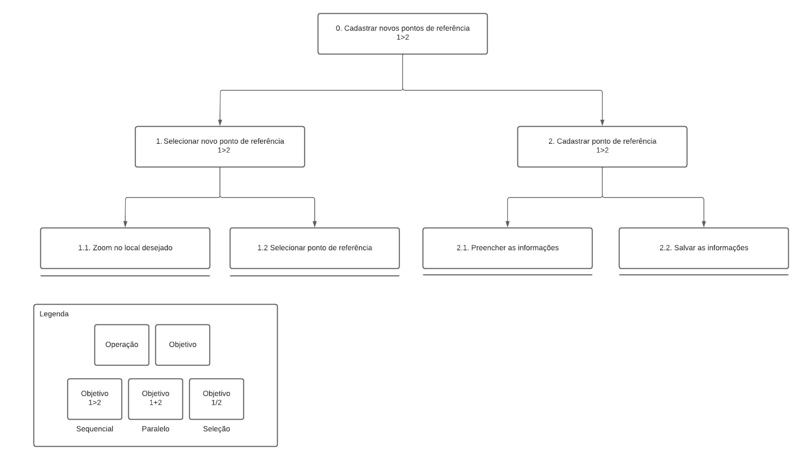
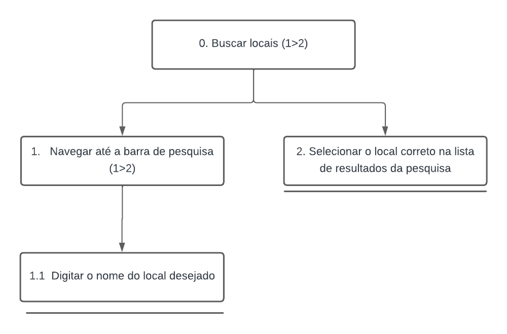

# Análise de Tarefas

## Introdução

A análise de tarefas é uma abordagem sistemática e metodológica usada para compreender como as pessoas realizam suas atividades na aplicação. Para isso, é necessário identificar os objetivos, ações, interações e os desafios enfrentados durante o uso do site. Essa compreensão é fundamental para o desenvolvimento de interfaces mais eficientes, intuitivos e amigáveis. As 6 tarefas analisadas do [OpenStreetMap](https://www.openstreetmap.org/) foram: 

<style>
  .etiqueta-container {
    display: flex;
    flex-wrap: wrap;
    justify-content: flex-start;
  }

  .margem{
    display: flex;
    flex-wrap: wrap;
    justify-content: flex-start;
    padding: 3px;
    margin: 1px;
  }

  .etiqueta {
    background-color: white;
    border: 2px solid rgba(0, 128, 0, 0.6);
    border-radius: 20px;
    box-shadow: 1px 1px 3px rgba(0, 0, 139, 0.1);
    padding: 5px;
    width: 300px;
    margin-bottom: 10px;
    text-align: center;
    font-size: 14px;
    font-weight: bold;
  }

  .etiqueta a {
    color: blue;
    text-decoration: none;
  }
</style>

<div class="etiqueta-container">
    <div class="margem"><a class="etiqueta" href="#T3">Adicionar uma nova estrada</a></div>
    <div class="margem"><a class="etiqueta" href="#T2">Buscar locais desejados</a></div>
    <div class="margem"><a class="etiqueta" href="#T1">Cadastrar ponto de referência</a></div>
    <div class="margem"><a class="etiqueta" href="#T4">Compartilhar localização em tempo real</a></div>
    <div class="margem"><a class="etiqueta" href="#T5">Explorar local turístico</a></div>
</div>

## Metodologias 
No geral, é preciso determinar qual é a tarefa e compreeender o propósito geral por trás dela e subdividir em tarefas menores. Para determinar as tarefas, utilizamos as informações do [questionários, perfil do usuário](perfil_usuario.md) e dos [cenários](cenarios.md) realizados. 

Foram escolhidas as metodologias mais usadas para a atividade, as quais são:

- <a href="#1">Análise	Hierárquica	de	Tarefas	(HTA	– Hierarchical Task Analysis)</a>
- <a href="#2">GOMS	(Goals,	Operators,	Methods, e	Selection	Rules)</a>
<!-- - <a href="#3">ConcurTaskTrees (CTT)</a> -->


<div id="1"></div>
### 1. HTA
A HTA ajuda a identificar a estrutura hierárquica das tarefas, decompondo-as em sub-tarefas menores e mais gerenciáveis. Isso permite uma compreensão mais detalhada de como as tarefas são executadas, identificando as relações entre as sub-tarefas e ajudando a identificar gargalos e oportunidades de melhoria.

A análise hierárquica de tarefas possui os seguintes elementos:

- **Tarefa**: Qualquer parte de um trabalho a ser realizado;
- **Objetivo**: um estado final, que pode ser definido por eventos ou valores fisicamente observáveis;
- **Subobjetivo**: Um objetivo de alto nível é dividido em subobjetivos;
- **Plano**: O conjunto de subobjetivos de um objetivo e suas relações consiste em um plano;
- **Operação**: Circunstâncias de ativação do objetivo (_input_ ou entrada), atividades ou ações (_actions_) para alcançá-lo e condições que indicam seu atingimento (_feedback_).

As tarefas escolhidas para serem analisadas com esta metodologia foram a de <a href="#T1">"Cadastrar novos pontos de referência"</a> e <a href="#T2">"Buscar locais desejados"</a>. Esses formam os usos mais apontados pelos usuário, por meio do [formulário](perfil_usuario.md) usado para construir o perfil do usuário.

A análise hierárquica de tarefas foi feita por meio das tabelas (Tabela 1 e 2) e por seu respectivo diagrama (Figura 2 e 3). Utiliza-se a notação representada na Figura 1.

<div style="text-align: center">
</img>
<p> Figura 1: Elementos do diagrama (Fonte: [1]).</p>
</div>

<div id="T1"></div>
#### **Tarefa 1 - Cadastrar ponto de referência**

| Objetivos/Operações | Problemas e recomendações |
| - | - |
| 0. Cadastrar novos pontos de referência (1>2)| **input**:  Acesso a página inicial;<br/> **feedback**: tela de pesquisa e mapa geral  <br/> **plano**: selecionar novo ponto de refereência e cadastrar-lo <br/> **recomendação**: permitir que usuário cadastre tarefa a partir da tela inicial |
| 1.  Selecionar novo ponto de refereência (1>2) | **plano**: dar zoom no mapa para o local desejado e selecionar o ponto de referência no mapa<br/> **recomendação**: abrir o mapa com zoom na área em que o usuário esta|
| 1.1  Dar zoom no mapa para o local desejado |   | |
| 1.2  Selecionar o ponto de referência no mapa |  | |
| 2  Cadastrar ponto de referÊncia (1>2)| **plano**: preencher as informações sobre o ponto de referência e salvar <br/> **recomendação**: salvar automáticamente, sem precisar apertar botão| |
| 2.1 Preencher as informações sobre o ponto de referência |  | |
| 2.2 Salvar as informações sobre o ponto de referência |  | |
<div style="text-align: center">
<p> Tabela 1: Análise Hierárquica de Tarefas para o objetivo "Cadastrar novos pontos de referência" (Fonte: Raquel, 2022).</p>
</div>



<div style="text-align: center">
<p> Figura 2: Diagrama da Análise Hierárquica de Tarefas para o objetivo "Cadastrar novos pontos de referência" (Fonte: Raquel, 2022).</p>
</div>

<div id="T2"></div>
#### **Tarefa 2 - Buscar locais desejados**

| Objetivos/Operações | Problemas e recomendações |
| - | - |
| 0. Buscar locais (1>2)| **input**:  Acesso a página inicial;<br/> **feedback**: tela de pesquisa e mapa geral  <br/>  |
| 1.   Navegar até a barra de pesquisa (1>2) | **input**:  Acesso à barra de pesquisa <br> **feedback**:  Tela de pesquisa e mapa geral|
| 1.1  Digitar o nome do local desejado | **input**: Digitar o nome do local desejado <br/> **feedback**: Resultados da pesquisa| |
| 2. Selecionar o local correto na lista de resultados da pesquisa | **input**: Selecionar o local correto na lista de resultados da pesquisa <br> **feedback**: Informações detalhadas sobre o local | |
<div style="text-align: center">
<p> Tabela 2: Análise Hierárquica de Tarefas para o objetivo "Buscar locais desejados" (Fonte: Guilherme, 2023).</p>
</div>

<div style="text-align: center">
</img>
<p> Figura 3: Diagrama da Análise Hierárquica de Tarefas para o objetivo "Buscar locais desejados" (Fonte: Guilherme, 2023).</p>
</div>

<div id="2"></div>
### 2. GOMS

O GOMS analisa as metas dos usuários, os operadores disponíveis, os métodos seguidos e as regras de seleção utilizadas. Essa análise permite identificar os passos e as ações necessárias para realizar uma tarefa, bem como possíveis gargalos cognitivos. Com base nessas informações, os projetistas podem otimizar o design dos sistemas, simplificando as interações, reduzindo a complexidade e tornando as tarefas mais eficientes e fáceis de serem executadas.

<!-- Explicar melhor -->

A tarefas escolhida para ser analisada com esta metodologia foi a de <a href="#T3">"Adicionar uma nova estrada no OpenStreetMap"</a>, correspondente ao [Cenários](cenarios.md) 1, 2 e 3.

<div id="T3"></div>

#### Tarefa 3 - Adicionar uma nova estrada
```
GOAL 0: Adicionar uma nova estrada
    GOAL 1: Selecionar edição 
        OP 1.1: Clicar no botão editar
    GOAL 2: Selecionar linha 
        OP 2.1: Clicar no botão linha
    GOAL 3: Selecionar edição 
        OP 3.1: Clicar no ponto onde começa a estrada
        OP 3.2: Clicar nos demais pontos que ligam a estrda
        OP 3.3: Apertar ESC ou clique sobre o último ponto para finalizar
    GOAL 4: Selecione o tipo de elemento
        OP 4.1: Clique na pasta vias principais ou secundárias
        OP 4.2: Clique no tipo de recurso desejado
    GOAL 5: Preencha as informações da estrada
        OP 5.1: Clique nos espaços que deseja preencher
        OP 5.2: Digite a informação
    GOAL 6: Salve os dados da estrada
        OP 6.1: Clique no botão salvar ou aperte CTRL+S
``` 
<div style="text-align: center">
<p> Código 1: GOMS - Tarefa 3 (Fonte: Raquel, 2023).</p>
</div>
<!-- 
<div id="3"></div>
### 3. CTT
Adicionar explicação sobre a metodologia 
As tarefas escolhidas para serem analisadas com esta metodologia foram a de <a href="#T4">"Compartilhar localização em tempo real"</a> e <a href="#T5">"Explorar local turístico"</a>. As quais correspondem aos [Cenários](cenarios.md) 2 e 3. -->

<div id="T4"></div>

#### Tarefa 4 - Compartilhar localização em tempo real
```
GOAL 0: Compartilhar localização em tempo real

    GOAL 1: Exibir sua localização
        OP 1.1: Clicar no botão de exibir localização
    GOAL 2: Abre a opçpão de compartilhamento
        OP 2.1: Clicar no botão de compartilhar localização
    GOAL 3: Selecionar modo de compartilhamento 
        OP 3.1: Clicar nas opções desejada (links, Geo Uri ou Imagem...)
        OP 3.2: Clicar no botão baixar para baixar a imagem ou copie o link desejado
``` 
<div style="text-align: center">
<p> Código 2: GOMS - Tarefa 4 (Fonte: Raquel, 2023).</p>
</div>
<div id="T5"></div>

#### Tarefa 5 - Explorar local turístico
```
GOAL 0: Explorar local turístico
    GOAL 1: Navegar até a barra de pesquisa do OpenStreetMap
        OP 1.1: Mover o cursor para a barra de pesquisa
    GOAL 2: Digitar o nome do local turístico 
        OP 2.1: Digitar o nome usando o teclado
    GOAL 3: Selecionar o local correto na lista de resultados da pesquisa
        OP 3.1: Clicar no local correto da lista
    GOAL 4: Aproxime para consultar o local
        OP 4.1: Role o scroll do mouse para cima até poder ver os elementos
    GOAL 5: Selecionar o botão consultar elementos
        OP 5.1: Clique nos botão consultar elementos que é último da lateral direita
    GOAL 6: Selecione os elementos no mapa
        OP 6.1: Clique nos elementos e obtenha mais informações sobre o local turístico
```
<div style="text-align: center">
<p> Código 3: GOMS - Tarefa 5 (Fonte: Raquel, 2023).</p>
</div>
## Bibliografia

[1] Barbosa, S. D. J.; Silva, B. S. da; Silveira, M. S.; Gasparini, I.; Darin, T.; Barbosa, G. D. J. (2021) Interação Humano-Computador e Experiência do usuário. Autopublicação. ISBN: 978-65-00-19677-1.

## Histórico de Versão
|    Data    | Data Prevista de Revisão | Versão |      Descrição       |                                                                Autor                                                                 |               Revisor               |
| :--------: | :----------------------: | :----: | :------------------: | :----------------------------------------------------------------------------------------------------------------------------------: | :---------------------------------: |
| 07/05/2023 |        08/05/2023        |  1.0   | Criação do documento | [Raquel](https://github.com/raqueleucaria) | [Daniel](https://github.com/daniel-de-sousa)|
| 19/05/2023 |        20/05/2023        |  2.0   | Correção do documento | [Raquel](https://github.com/raqueleucaria) e [Guilherme](https://github.com/guilhermekishimoto) | [Daniel](https://github.com/daniel-de-sousa)|