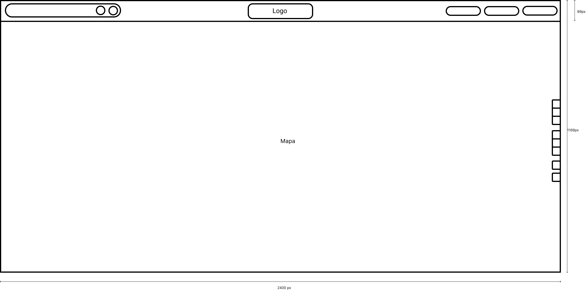
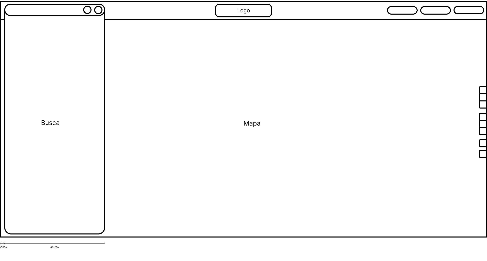
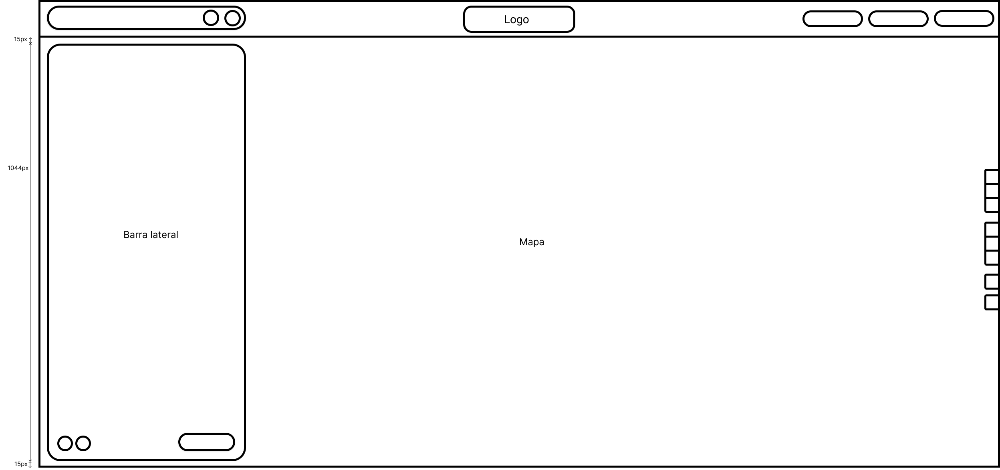
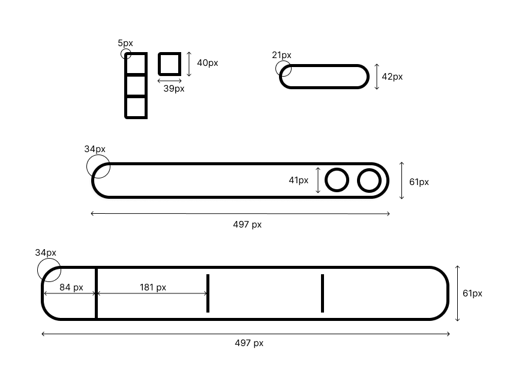
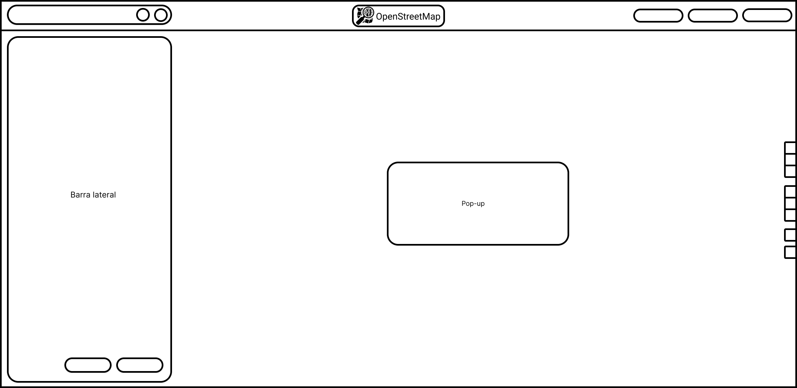
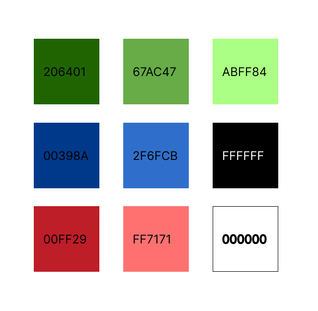
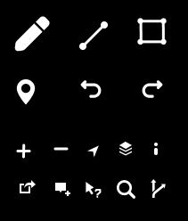
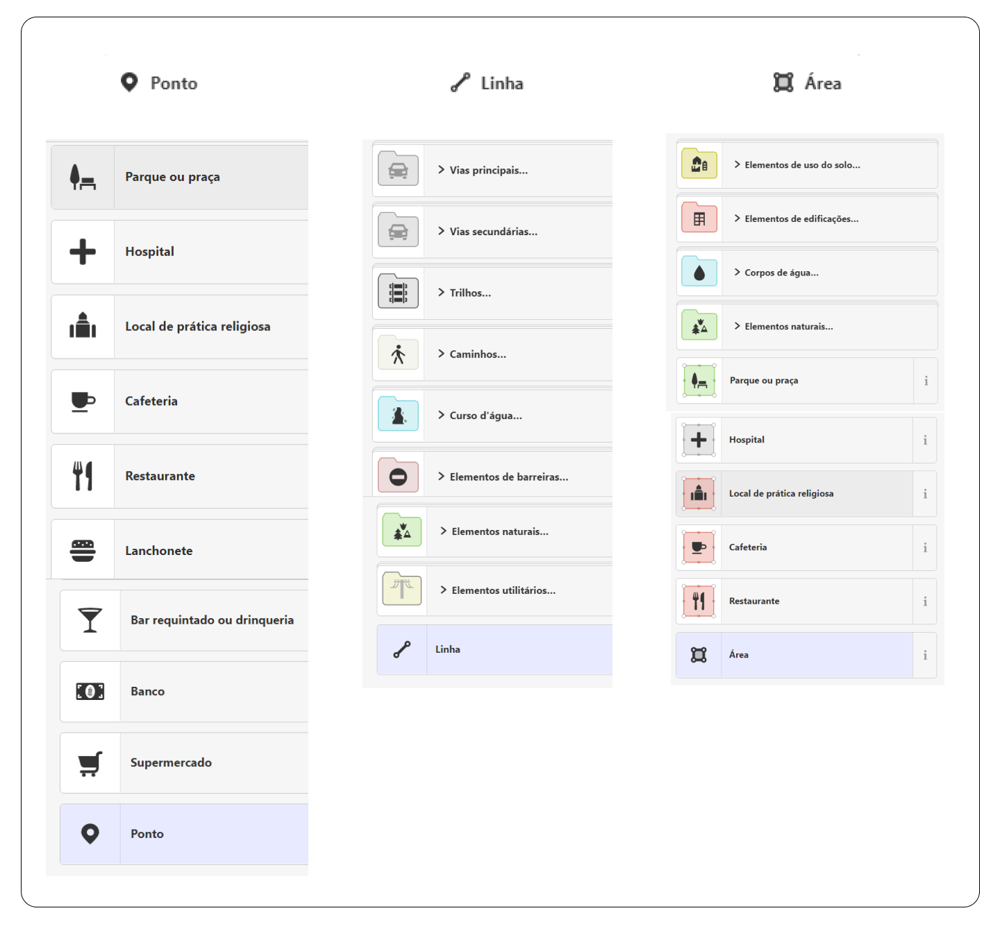

# Guia de estilo

# 1. Introdução

O guia de estilo é um documento que reúne as decisões de design em um projeto, servindo como uma linha de comunicação entre a equipe de design e desenvolvimento. Ele estabelece diretrizes visuais e de interação para garantir a consistência e facilitar a implementação do produto final. É fundamental criar um guia de estilo bem elaborado para assegurar a qualidade e o sucesso do projeto, proporcionando uma referência acessível e promovendo a eficiência no desenvolvimento. Dessa forma, foi criado este documento para reunir tais informações sobre o [OpenStreetMap]([https://www.openstreetmap.org/](https://www.openstreetmap.org/)).

## 1.1. Objetivo

Reunir as informações sobre a padronização de estilo criada para o site [OpenStreetMap](). E facilitar a comunicação entre os membros da equipe e demais interessados na questão de design, prototipação e desenvolvimento do produto final.

## 1.2. Organização do conteúdo
O guia de estilo seguirá a estrutura comum adotada por Mayhew, na seguinte organização:

- Introdução
    - Objetivo
    - Organização e Conteúdo
    - Público-alvo
    - Como Utilizar e Manter o Guia de Estilo
- Análise do Ambiente de Trabalho
- Elementos de Interface
    - Janelas
    - Tipografia
    - Cores
- Elementos de Interação
    - Estilos de Interação
    - Seleção de Estilos
    - Aceleradores (teclas de atalho)
- Elementos de Ação
    - Preenchimento de Campos
    - Seleção
    - Ativação
- Vocabulário e Padrões
    - Terminologia
    - Sequência de Diálogos

## 1.3. Público-Alvo

O guia de estilo funciona como uma linha de comunicação entre a equipe de design e desenvolvimento. Dessa forma, todas as pessoas ligadas a definição de requisitos até a codificação e criação da camada de apresentação são público-alvo deste documento. Assim, analistas de negócio, desenvolvedores, design, estudantes da matéria de Interação Humano Computador, ou qualquer outra pessoa que tenha conexão com OpenStreetMap ou com análise de requisitos são o alvo deste Guia de Estilo.

## 1.4. Como utilizar e Manter 

O guia de estilo deve ser consultado sempre que decisões de projeto precisarem ser tomadas, como em casos de manutenção ou desenvolvimento de novas funcionalidades. Ele foi criado para ser usado na disciplina de IHC, porém pode ser usado para demais interessados.

Qualquer alteração significativa no site deve ser adicionado ao Guia de Estilo.
Isso assegura que o documento esteja em conformidade com o projeto atual, promovendo a padronização. Essa prática também contribui para que todos os membros da equipe estejam alinhados e tenham acesso às informações mais atualizadas.

# 2. Análise do Ambiente de Trabalho
O usuário precisa que o ambiente seja simples, com boa disposição dos elementos para que se tenha um bom entendimento dos textos e adaptado ao seu ambiente. Tendo o [Perfil de Usuário](./perfil_usuario.md), criado com base em questionários, percebemos a afinidade dos participantes com tecnologia, e como as maiores funcionalidades do site estão na versão desktop, é possível definir o ambiente de principal de trabalho do usuário como computador de mesa ou notebook.

# 3. Elementos de interface

## 3.1. Disposição espacial e grid

### Disposição espacial

A disposição das páginas ocorre no geral da seguinte forma (Figura 1, 2 e 3). Visando a simplicidade, é proposto uma disposição mais simples, concentrando as informações no menu lateral. Assim, as informações ficam em uma área só, o que é mais fácil para entender e utilizar o site. 

Diferente do site atual, a logo foi para o centro e a barra de pesquisa foi puxada para cima, visando a economia de espaço e aproveitamento da área definida para concentrar as informações.

 Figura 1 - Disposição espacial 

 Figura 2 - Disposição espacial - Barra de pesquisa 

 Figura 3 - Disposição espacial - Barra lateral

### Grid
Nas figuras 1, 2 e 3 é possível ver a dimensão estabelecida para a página. Elas devem ter a proporção respeitada, considerando a dimensão da tela que será projetada. Além dessas dimensões, os elementos presentes no site, apresentam os tamanhos definidos na Figura 4.

 Figura 4 - Grid elementos

## 3.2. Janelas
O site atualmente possui poucas janelas, porém ainda poderiam ser reduzidas, nessas guia, foi estabelecido o uso de uma da janela  e caso necessário, o uso de _pop-up_, conforme a Figura 5.

Os _pop-up_ seram usados para confirmar uma ação, carregamento...

 Figura 5 - Janelas

## 3.3. Tipografia

O site utiliza diversas familias de fonte (*Figura 6*), devido ao uso do “System UI font” que é a fonte da interface do usuário, por isso a fonte pode variar conforme o sistema operacional utilizado por quem acessa. Além disso, varia seus tamanhos entre 10px, 14px ,18 px e mais, dependendo do contexto do texto na interface.

Devido ao carater adaptafico, e como todas as fonte permanecem com sem serifa, o que facilitra a leitura do texto, por não ser desenha. Essa definição foi mantida para este guia de estlo

 Figura 6 - Fonte

## 3.4. Cores

A *Figura 7* apresenta a paleta de cores da logo e a utilizada na aplicação. Ela foi reduzida ao uso principal das cores verde, azul e vermelho. Além de algumas variações dos tons princpais, quanto a transparência, foram utilizados alguns tons de cinza.

Assim, o site segue a simplicidade aplicada na disposição das telas. A cor verde é a predominante, seguindo a logo, o azul será usado para elementos que indiquem o redirecionamento  de conteúdo e o vermelho para destacar alguma informação.

 Figura 7 - Cores 

# 4. Elementos de Interação

### 4.1. Estilos de interação

A *Figura 8* mostra os elementos principais de navegação no mapa. Com um estilo bem simples e intuitivo. Alguns ícones foram retirados como o de salvar, que era muito parecido com o de compartilhamento, na maioria foram mantidos e acrescentados um de edição.

 Figura 8 - Ícones 

### 4.1. Seleção de um estilo

**Mapas**

O mapa no site possui 6 váriações que podem ser selecionados, conforme a *Figura 9*. Algumas voltadas para um objetivo específico como rotas para bicicleta, transporte público… Tais estilos visam diferentes usos, o que possibilita uma visualização mais crítica, tais elementos permanecem para este guia de estilo

 Figura 9 - Seleção 

# 5. Elementos de ação

## 5.1. Preenchimento
<!-- CORRIGIR -->

O campo de preenchimento principal é o de buscar local, além do de registro e login, conforma a figura 8. 

 Figura 10 - Preenchimento

## 5.2. Seleção

Para criar uma ponto de referência, linha para rota ou área, é apresentado os seguintes botões (Figura 9). Que foram mantidos do site atual, por apresentarem uma simplicidade e boa organização.

 Figura 11 - Elementos de Interface

# 6. Vocabulário e padrões

## 6.1. Terminologia

É importante utilizar **terminologias** que sejam familiares aos usuários, evitando termos muito técnicos. Caso seja necessário utilizar termos técnicos, é essencial fornecer explicações claras e pontuais para garantir que até mesmo os usuários iniciantes possam utilizar a aplicação de forma intuitiva.

## 6.2. Sequências de diálogos

A **sequência de diálogos** (para feedback ou confirmação de uma operação) a serem feitos com o usuário por meio dos elementos de interface devem ser feitos de forma padronizada. 

# Bibliografia

> BARBOSA, Simone; DINIZ, Bruno. Interação Humano-Computador. Editora Elsevier, Rio de Janeiro, 2010.

## Histórico de Versão
|    Data    | Data Prevista de Revisão | Versão |      Descrição       |                                                                Autor                                                                 |               Revisor               |
| :--------: | :----------------------: | :----: | :------------------: | :----------------------------------------------------------------------------------------------------------------------------------: | :---------------------------------: |
| 14/05/2023 |        15/05/2023        |  1.0   | Criação do documento | [Raquel](https://github.com/raqueleucaria) | [Daniel](https://github.com/daniel-de-sousa)|
| 26/06/2023 |        27/06/2023        |  2.0   | Correção, conforme verificação | [Raquel](https://github.com/raqueleucaria) | [Daniel](https://github.com/daniel-de-sousa)|