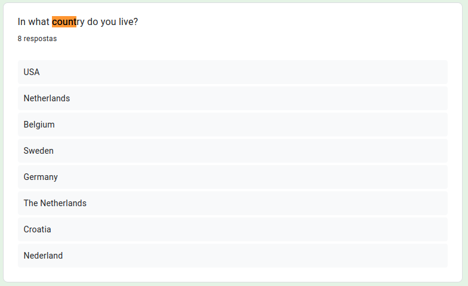

# Perfil do Usuário
## Introdução
O perfil de usuário é uma parte importante para se desenvolver um sistema, é preciso entender quem são os usuários para que se possa concentrar os esforços para que o sistema esteja de acordo com o que eles precisam.

## Objetivo
Com as informações obtidas através do questionário, foi possível traçar o perfil dos possíveis usuários do site Open Street Map, identificando as características mais comuns entre eles, como faixa etária, nível de escolaridade e frequência de uso do site Open Street Map.

Esses dados serão utilizados pelo grupo para poderem se orientar sobre quem é o usuário e como ele se comporta, a fim de que todos possam estar focados no mesmo objetivo, principalemente na tomada de decisões.

Como também será parte importante na elicitação de requisitos dos usuários, poís dara vida as personas para serem utilizadas no projeto.

## Metodologia
Para traçar o perfil dos possíveis usuários do site Open Street Map, optamos por utilizar um questionário como instrumento de pesquisa. O questionário é uma técnica de coleta de dados muito utilizada em pesquisas quantitativas, pois permite obter informações sobre as características dos respondentes de forma padronizada e objetiva.

O questionário foi desenvolvido com perguntas específicas sobre o uso do aplicativo, como por exemplo, se já haviam utilizado o site Open Street Map, qual a frequência de uso, quais as funcionalidades mais utilizadas, entre outras.

Além disso, também foram incluídas perguntas sobre as características socioeconômicas dos possíveis usuários, como idade, gênero e escolaridade, para que pudéssemos entender melhor o perfil dos respondentes.

### Vantagens

A utilização de questionários nos traz como vantagem:

<ul>
    <li> 
        Padronização dos dados: garante que todas as informações sejam obtidas de forma uniforme, facilitando análises posteriores;
    </li>
    <li> 
        Rapidez: permite a coleta de um grande número de dados em um pequeno espaço de tempo;
    </li>
    <li> 
        Redução de erros: devido a padronização, a utilização de formulários reduz a ocorrência de erros de preenchimento.
    </li>
</ul>

### Desvantagens 

A utilização de questionários nos traz como desvantagem:

<ul>
    <li> 
        Restições a opções de resposta: apesar de a padronização de respostas também poder ser considerada uma vantagem, ela pode atrapalhar ao limitar as possibilidades de respostas dos participantes;
    </li>
    <li> 
        Dificuldade de interpretar algumas respostas: em alguns casos, as respostas dos participantes podem não ser claras o suficiente, atrapalhando a análise dos dados.
    </li>
    <li> 
        Baixa taxa de resposta: A aplicação de formulários pode resultar em uma baixa taxa de resposta, o que pode comprometer a representatividade dos resultados;
    </li>
</ul>

## Divulgação

Foi divulgado um questionário em diferentes plataformas online com o objetivo de atingir o público-alvo do site Open Street Map. Essas plataformas incluem grupos do WhatsApp, servidores do Discord e o fórum do próprio site.

A escolha dessas plataformas para a divulgação do questionário foi feita com base no perfil dos usuários dessas comunidades online, que provavelmente possuem interesse em mapeamento colaborativo e contribuição de dados geográficos para a plataforma Open Street Map.

Essa estratégia de divulgação do questionário em múltiplas plataformas ajuda a maximizar o alcance da pesquisa e a obter uma amostra mais representativa da população-alvo. Além disso, permite que sejam coletados dados de usuários com diferentes perfis e experiências, enriquecendo ainda mais a análise dos resultados da pesquisa.

## Planejamento

Para a confecção do questionário, primeiramente foi pensado em um termo de consentimento para que os participantes tivessem ciência do que se travata a pesquisa e que seus dados seriam utilizados para o andamento da mesma. O termo pode ser lido na imagem 1: 

Imagem 1: Termo de Consentimento (Fonte: autor, 2023).

Em seguida, debatemos quais informações desejávamos descobrir sobre os usuários da plataforma:

<ul>
    <li>
        Qual a idade dos usuários? Pessoas mais jovens costumam utilizar mais o site?
    </li>
    <li>
        Onde o usuário reside? O site é utilizado globalmente?
    </li>
    <li>
        Qual o nível de escolaridade do usuário? Usuários com mais instrução tendem a usar mais o site?
    </li>
    <li>
        Os usuários possuem boas habilidades com tecnologia? O que facilitaria a utilização do site.
    </li>
    <li>
        Os usuários são empregados? Eles costumam trabalhar na área de TI?
    </li>
    <li>
        Como os usuários aprenderam a usar o site? O site é intuitivo ou precisam de instruções?
    </li>
    <li>
        Para que os usuários utilizam o site? Há uma funcionalidade mais utilizada?
    </li>
    <li>
        Os usuários já estão acostumados a usar outros aplicativos de geolocalização? 
    </li>
    <li>
        O que os usuários acham do site? Precisa de novas funcionalidades? 
    </li>
</ul>

Com base nessas dúvidas, foram elaboradas 14 questões, abertas e objetivas, com o intuito de coletar dados que achavamos relevantes para traçar o perfil do usuário. Para isso, utilizamos como base o livro Interação Humano Computador dos autores Simone Barbosa e Bruno Silva. As 14 questões formuladas são listadas a baixo:

<ul>
    <li>
        Qual sua faixa etária?
    </li>
    <li>
        Em que região você reside?
    </li>
    <li>
        Qual seu nível de escolaridade?
    </li>
    <li>
        Você trabalha? Se sim, qual cargo?
    </li>
    <li>
        Você utiliza o site Open Street Map?
    </li>
    <li>
        Como você classificaria suas habilidades na área de tecnologia?
    </li>
    <li>
        Como você aprendeu a usar o site Open Street Map?
    </li>
    <li>
        Qual é seu principal objetivo ao utilizar o site Open Street Map?
    </li>
    <li>
        Com qual frequência você utiliza o site Open Street Map?
    </li>
    <li>
        Você utiliza outros sites de geolocalização? Se sim, quais?
    </li>
    <li>
        Você acredita que o site Open Street Map atende às suas necessidades? Se não, o que gostaria de ver no site?
    </li>
    <li>
        Você diria que o site é fácil de ser usado? Se não, por que?
    </li>
    <li>
        Em uma escala de 1 a 5, qual sua avaliação da interface do Site Open Street Map?
    </li>
    <li>
        Em uma escala de 1 a 5, qual sua avaliação geral do site da Open Street Map?
    </li>
</ul>

Também traduzimos o formulário para a língua inglesa, para que fosse possível divulgar o formulário para a comunidade estrangeira.

## Resultados

O grupo se empenhou para divulgar o questionário de forma que abrangesse os mais diferentes grupos. Ao todo, foram coletadas de 47 pessoas no período de 5 dias (03/04 - 08/04), sendo 16 pessoas usuárias do site, como pode ser visto nas imagens 9 e 10. Para fins de organização, vamos nos fererir ao formulário aplicado em comunidades brasileiras como formulário 1 e o aplicado em comunidades estrangeiras como formulário 2. Os resultados são apresentados nas imagens 2 a 28 e também podem ser observados na seguintes planilhas: [planilha do formulário 1](https://docs.google.com/spreadsheets/d/16ACysMkoAq0VO-ueKC4ZtjG9sz-M9lXLhcHS69W2qoI/edit?usp=sharing)
e [planilha do formulário 2](https://docs.google.com/spreadsheets/d/1GgHmSVmk0lHrWRn2qZZEWpfEQIrxAK4iZmbRz1iAVOA/edit?usp=sharing). 

### Resultado Geral

- Faixa etária, presentes nas imagens 2 e 3.

Imagem 2: Idade dos usuários - Formulário 1 (Fonte: autor, 2023).

Imagem 3: Idade dos usuários - Formulário 2 (Fonte: autor, 2023).

Como podemos ver na imagem 2 e 3, a maioria dos participantes possuem idade entre 18 a 30 anos.

- País que o participante reside, presente na imagem 4.

Imagem 4: País de residência - Formulário 2 (Fonte: autor, 2023).

Como podemos ver na imagem 4, conseguimos abranger participantes de diversos países e, já que o formulário 1 foi divulgado em grupos brasileiros, concluímos que todas as suas respostas são de brasileiros residentes no Brasil.

- Grau de escolaridade, presente nas imagens 5 e 6.

Imagem 5: Grau de Escolaridade - Formulário 1 (Fonte: autor, 2023).

Imagem 6: Grau de Escolaridade - Formulário 2 (Fonte: autor, 2023).

Como podemos ver na imagem 5 e 6, a maioria dos participantes possuem ensino superior incompleto.

- Profissão

Segundo os dados coletados, a maioria dos usuários atua na área de TI, como pode ser observado nas planilhas: [planilha do formulário 1](https://docs.google.com/spreadsheets/d/16ACysMkoAq0VO-ueKC4ZtjG9sz-M9lXLhcHS69W2qoI/edit?usp=sharing)
e [planilha do formulário 2](https://docs.google.com/spreadsheets/d/1GgHmSVmk0lHrWRn2qZZEWpfEQIrxAK4iZmbRz1iAVOA/edit?usp=sharing). 

- Quantidade de pessoas que usam o site, presentes nas imagens 7 e 8.

Imagem 7: Quantidade de usuários - Formulário 1 (Fonte: autor, 2023).

Imagem 8: Quantidade de usuários - Formulário 2 (Fonte: autor, 2023).

Como podemos ver na imagem 7 e 8, dentre os participantes, temos 16 usuários do site Open Street Map.

- Afinidade dos participantes com tecnologia, presentes nas imagens 9 e 10.

Imagem 9: Afinidade com Tecnologia - Formulário 1 (Fonte: autor, 2023).

Imagem 10: Afinidade com Tecnologia - Formulário 2 (Fonte: autor, 2023).

Como podemos ver na imagem 9 e 10, dentre os participantes, temos 16 usuários do site Open Street Map.

### Resultado dos Usuários
Nessa seção, vamos apresentar os dados dos participantes que também são usuários do site Open Street Map.

- Faixa etária

A maioria dos usuários possuem entre 18 a 30 anos.

- Nível de escolaridade

A maioria dos usuários possuem ensino superior incompleto.

- Quantidade de usuários empregados

A maioria dos usuários são empregados e trabalham na área de TI.

- Afinidade com tecnologia

A maioria dos usuários declaram que possuem afinidade com tecnologia.

### Sobre o aplicativo

- Como os usuários aprenderam a usar o aplicativo, presentes nas imagens 11 e 12

Imagem 11: Aprendizado do Site - Formulário 1 (Fonte: autor, 2023).

Imagem 12: Aprendizado do Site - Formulário 2 (Fonte: autor, 2023).

Como podemos ver na imagem 11 e 12, a maioria dos usuários aprenderam a usá-lo navegando pelo mesmo.

- Para que os usuários utilizam o site, presentes nas imagens 13 e 14.

Imagem 13: Principal Funcionalidade Utilizada - Formulário 1 (Fonte: autor, 2023).

Imagem 14: Principal Funcionalidade Utilizada - Formulário 2 (Fonte: autor, 2023).

Como podemos ver na imagem 13 e 14, a maioria dos usuários utilizam o site para cadastrar novos pontos de referência.

- Com que frequencia os usuários utilizam o site, presentes na imagem 15 e 16.

Imagem 15: Frequencia de Utilização - Formulário 1 (Fonte: autor, 2023).

Imagem 16: Frequencia de Utilização - Formulário 2 (Fonte: autor, 2023).

Como podemos ver na imagem 15 e 16, a maioria dos usuários utilizam o site todos os dias.

- Os usuários utilizam outros sites de geolocalização, presentes nas imagens 17 e 18.

Imagem 17: Outros Sites Utilizados - Formulário 1 (Fonte: autor, 2023).

Imagem 18: Outros Sites Utilizados - Formulário 2 (Fonte: autor, 2023).

Como podemos ver na imagem 17 e 18, a maioria dos usuários utilizam outros sites de geolocalização.

- Os usuários acham que o aplicativo atende a suas necessidades, presentes nas imagens 19 e 20.

Imagem 19: Necessidades do Usuário - Formulário 1 (Fonte: autor, 2023).

Imagem 20: Necessidades do Usuário - Formulário 2 (Fonte: autor, 2023).

Como podemos ver na imagem 19 e 20, a maioria dos usuários acredita que o site precisa de melhorias.

- Os usuários acham que o site fácil de se utilizar, presentes nas imagens 21 e 22.

Imagem 21: Experiência do Usuário - Formulário 1 (Fonte: autor, 2023).

Imagem 22: Experiência do Usuário - Formulário 2 (Fonte: autor, 2023).

Como podemos ver na imagem 21 e 22, a maioria dos usuários acredita que o site não seja fácil de se usar, principalmente para principiantes.

- Como os usuários avaliam a interface, presentes nas imagens 23 e 24

Imagem 23: Avaliação da Interface - Formulário 1 (Fonte: autor, 2023).

Imagem 24: Avaliação da Interface - Formulário 2 (Fonte: autor, 2023).

Como podemos ver na imagem 23 e 24 segundo a avaliação dos usuários, temos uma média de 3,5 para a interface numa escala de 1 a 5.

- Como os usuários avaliam o site, presentes nas imagens 25 e 26.

Imagem 25: Avaliação do Site - Formulário 1 (Fonte: autor, 2023).

Imagem 26: Avaliação do Site - Formulário 2 (Fonte: autor, 2023).

Como podemos ver na imagem 25 e 26 segundo a avaliação dos usuários, temos uma média de 3,8 para o site de forna geral numa escala de 1 a 5.

## Referências

> Barbosa, S. D. J.; Silva, B. S. da; Silveira, M. S.; Gasparini, I.; Darin, T.; Barbosa, G. D. J. (2021) Interação Humano-Computador e Experiência do usuário. Autopublicação. ISBN: 978-65-00-19677-1.

## Histórico de Versão
|    Data    | Data Prevista de Revisão | Versão |      Descrição       |                                                                Autor                                                                 |               Revisor               |
| :--------: | :----------------------: | :----: | :------------------: | :----------------------------------------------------------------------------------------------------------------------------------: | :---------------------------------: |
| 08/05/2023 |        08/05/2023        |  1.0   | Criação do documento | [Carla](https://github.com/ccarlaa) e [Daniel](https://github.com/daniel-de-sousa)| [Paulo](https://github.com/PauloVictorFS) |
| 19/06/2023 |        19/06/2023        |  1.1   | Correção do Documento | [Daniel](https://github.com/daniel-de-sousa) | [Guilherme](https://github.com/guilhermekishimoto) |