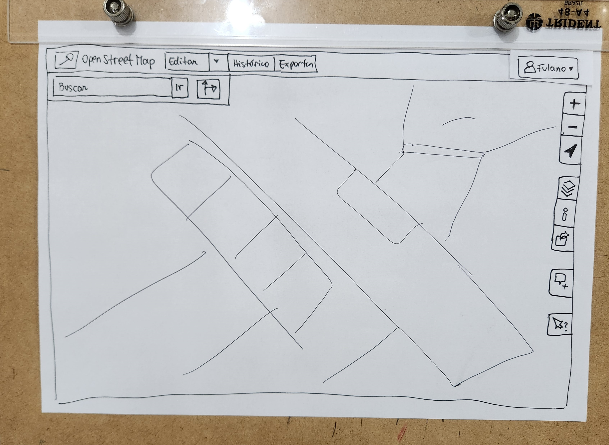
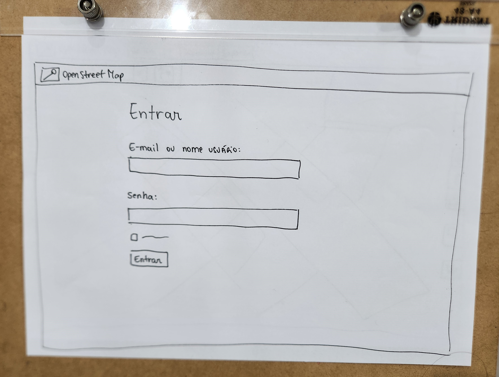
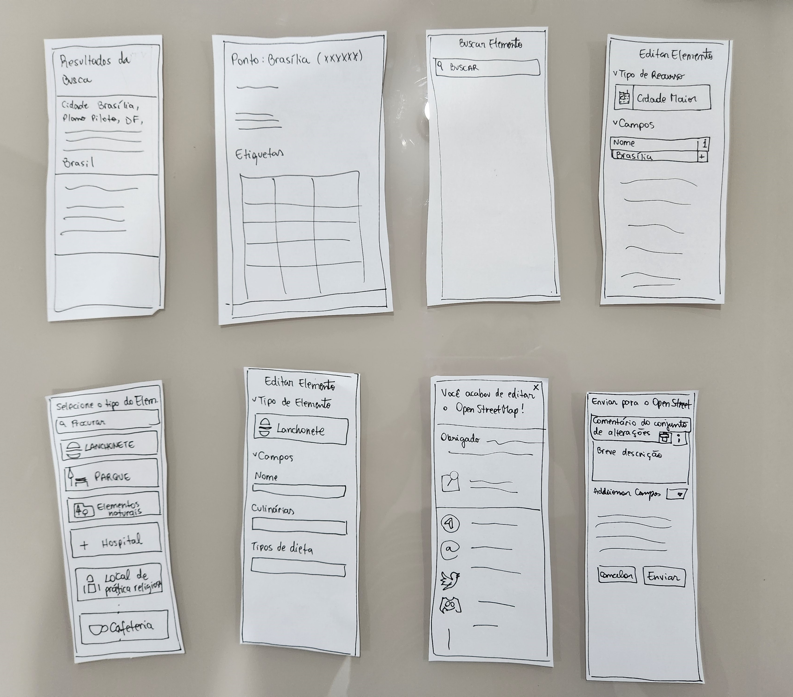
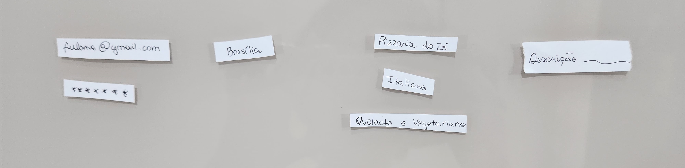

# Planejamento do relato dos resultados da avaliação do Protótipo de Papel

## Introdução

O objetivo do Planejamento do relato dos resultados da avaliação do Protótipo de Papel é estabelecer um esquema de como a avaliação do protótipo de papel deve ser relatada, ou seja, como os resultados devem ser expostos e verificados pelos membros da equipe que irá avaliar. Este documento estabelece os elementos que devem existir no relato dos resultados.

## Elementos do relato de resultados

1. Objetivo
2. Metodologia
3. Participantes e avaliadores
4. Respostas das perguntas
5. Gravações
6. Conclusão

## Objetivos da avaliação

No relato dos resultados, os objetivos da avaliação devem ser explicitados de maneira clara e objetiva, a fim de possibilitar uma verificação na conclusão do artefato. No caso, a avaliação tem como objetivo entender no aplicativo e em fluxos alternativos, o que está sendo bem implementado e o que seria melhor alterar, tendo uma lista de feedback de usuários reais.

## Metodologia

Os métodos utilizados para a realização desta avaliação serão introduzidos e justificados. Além disso, deve ser feita uma breve descrição de como a avaliação ocorreu. E será utilizado [entrevistas](./planejamento_Prototipopapel.md) para coletar os pontos negativos e positivos do design. Além disso, a entrevista permitá realizar uma série de perguntas para direcionar a simulação.

### Protótipo de Papel
Um dos protótipos que serão apresentados é o referente a [Tarefa 1 - Cadastrar ponto de referência](../../AnaliseRequisitos/analiseTarefas.md) que esta representado nas FIguras 1, 2, 3, 4, 5 e 6. Além disso, o fluxo esperado durante a entrevista bo Vídeo 1.

#### Protótipo 1- Cadastrar ponto de referência

</img>

 Figura 1: Janela principal (Fonte: Raquel).

</img>

 Figura 2: Janela login (Fonte: Raquel).

</img>

 Figura 3: Mapas (Fonte: Raquel).

</img>

 Figura 4: Barras laterais (Fonte: Raquel).

</img>

 Figura 5: Componentes (Fonte: Raquel).

</img>

 Figura 6: Inputs (Fonte: Raquel).

<video width="640" height="480" controls>
    <source src="../../../assets/prototipo-papel/prototipo1.mp4" type="video/mp4">
    Seu navegador não suporta a tag de vídeo.
</video>

 Vídeo 1: Fluxo esperado (Fonte: Raquel).

## Participantes e avaliadores

Todos os participantes da avaliação, bem como os avaliadores designados, serão listados. E o usuário escolhido deve estará de acordo com o [perfil do usuário](../../AnaliseRequisitos/perfil_usuario.md).

## Respostas das perguntas

Todas as perguntas devem ser regisrtadas de forma clara e organizada.

## Gravações 

Como as entrevistas serão gravadas, o vídeo com a realização da avaliação estar disponibilizado no Youtube e anexado ao documento.

## Conclusão

Os resultados deverão ser analisados conforme a metodologia estabelecida. E deverá ser feito uma observação e interpretação do dados obtidos, além de ressaltar problemas encontrados e as possíveis soluções correspondentes.

## Bibliografia
> SIMONE DINIZ JUNQUEIRO BARBOSA, BRUNO SANTANA DA SILVA, Interação Humano-Computador, 1a. Edição, Editora Campus, 2010

## Histórico de versão
|    Data    | Data Prevista de Revisão | Versão |      Descrição       |                                        Autor                                         |                   Revisor                   |
| :--------: | :----------------------: | :----: | :------------------: | :----------------------------------------------------------------------------------: | :-----------------------------------------: |
| 28/05/2023 |        29/05/2023        |  1.0   | Criação do documento | [Raquel](https://github.com/raqueleucaria) | [Caetano](https://github.com/caeslucio) |