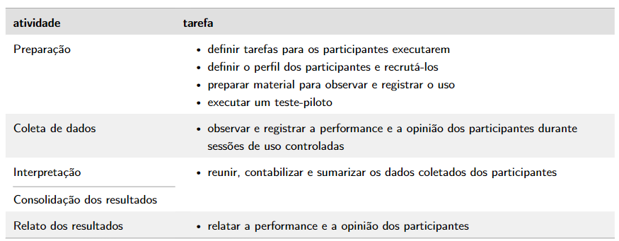

# Planejamento da Avaliação do Protótipo de Papel

## Introdução
Este documento descreve o Planejamento da Avaliação de Papel do protótipo do OpenStreetMap, visando identificar problemas de usabilidade, coletar feedback dos usuários e validar o design proposto. O protótipo de baixa fidelidade é uma versão mais simplificado do produto que permite uma avaliação inicial das funcionalidades e da experiência do usuário. A avaliação será realizada seguindo uma abordagem sistemática, utilizando técnicas específicas e considerando aspectos éticos.

## Metodologia
O planejamento da Avaliação do Protótipo de Papel será conduzido através do uso do Framework DECIDE, de Preece et al. (2002)[[1](#referencia-bibliografia)], onde cada letra representa uma fase específica do planejamento, na tabela 1 é possível visualizar o que cada letra representa. E também será usado como base as atividades básicas: Preparação, Coleta de Dados, Interpretação, Consolidação e Relato dos Resultados, propostas por Simone no livro IHC-UX[[2](#referencia-bibliografia)].

| Letra |                             Definição                              |
| :---: | :----------------------------------------------------------------: |
|   [D](#d-objetivos)   |            Determinar os objetivos da avaliação de IHC.             |
|   [E](#e-explorar-perguntas)   |     Explorar as perguntas a serem respondidas com a avaliação.      |
|   [C](#c-metodo-de-avaliacao)   |  (*Chose*) Escolher os métodos que serão utilizados na avaliação.   |
|   [I](#i-questoes-praticas-preparacao)   |    Identificar e administrar as questões práticas da avaliação.     |
|   [D](#d-questoes-eticas)   |             Decidir como lidar com as questões éticas.              |
|   [E](#e-interpretacao-e-resultados-dos-dados)   | (*Evaluate*) Interpretar e apresentar os dados da avaliação de IHC. |

Tabela 1 - Metodologia DECIDE (Fonte: Autor, 2023)

## D - Objetivos
Os objetivos são os aspectos alvos da investigação do OpenStreetMap. E são os seguintes:

- **1. Análise de ideias e alternativas de design**: Avaliar a facilidade de aprendizado (quanto ao uso) e o tempo necessários para o desenvolvimento de cada alternativa (quanto a construção) comparando com o site atual.
- **2. Identificação de problemas na interação e na interface**: Identificar problemas na interação e na interface que prejudiquem a qualidade de uso do sistema, classificados em grau de impacto nocivo, frequência e fatores de qualidade (usabilidade, experiência do usuário, acessibilidade ou comunicabilidade).

## E - Explorar Perguntas
Levando em consideração os objetivos da avaliação, foram estabelecidas as seguintes perguntas:

**Análise de alternativa**

  - Qual das alternativas é a mais eficiente? Mais fácil de aprender?
  - Qual delas pode ser construída em menos tempo?
  - De qual delas se espera que tenha um impacto negativo menor ao ser adotada?
  - Qual delas torna mais evidente os diferenciais da solução projetada?
  - Qual delas os usuários preferem? Por quê?
  
**Identificação de problemas**

  - O usuário consegue operar o sistema?
  - Ele atinge seu objetivo? Com quanta eficiência? Em quanto tempo? Após cometer quantos erros?
  - Que parte da interface e da interação o deixa insatisfeito?
  - Que parte da interface o desmotiva a explorar novas funcionalidades?
  - Ele entende o que significa e para que serve cada elemento de interface?
  - Ele vai entender o que deve fazer em seguida?
  - Que problemas de IHC dificultam ou impedem o usuário de alcançar seus objetivos?
  - Onde esses problemas se manifestam? Com que frequência tendem a ocorrer? Qual é a gravidade desses problemas?
  - Quais barreiras o usuário encontra para atingir seus objetivos?
  - Ele tem acesso a todas as informações oferecidas pelo sistema

## C - Método de Avaliação
O método de avaliação escolhido, dentro dos métodos de observação, foi o **teste de usabilidade** que visa avaliar a usabilidade de um sistema interativo a partir de experiências de uso dos seus usuários-alvo (Rubin, 1994[[3](#referencia-bibliografia)]; Rubin e Chisnell, 2008[[4](#referencia-bibliografia)]). Tendo os objetivos definidos, podemos estabelecer os critérios de avaliação, relacionados a dados mensuráveis. Assim, será observado e registrado os dados referentes ao desempenho dos participantes na realização das tarefas, suas opiniões e sentimentos ao usarem o sistema. Seguindo as atividades do teste de usabilidade, conforme a Figura 1.

Figura 1 - Atividades do teste de usabilidade (Fonte: Simone [<a href="#referencia-bibliografia">5</a>] )

## I - Questões Práticas (Preparação)

### Tarefas
As tarefas a serem executadas pelos participantes foram retiradas da [Análise de Tarefas](../../AnaliseRequisitos/analiseTarefas.md), e são:

1. [Buscar local](../../../AnaliseRequisitos/analiseTarefas/#tarefa-2-buscar-locais-desejados);
2. [Cadastrar Ponto de Referência](../../../AnaliseRequisitos/analiseTarefas/#tarefa-1-cadastrar-ponto-de-referencia);
3. [Compartilhar localização em tempo real](../../../AnaliseRequisitos/analiseTarefas/#tarefa-4-compartilhar-localizacao-em-tempo-real);
4. [Cadastrar Estrada](../../../AnaliseRequisitos/analiseTarefas/#tarefa-3-adicionar-uma-nova-estrada);
5. [Explorar local turístico](../../../AnaliseRequisitos/analiseTarefas/#tarefa-5-explorar-local-turistico).

### Perfil dos participantes
A quantidade mínima de participantes será de 3 pessoas, sendo esse um número adequado segundo Krug. Considerando o [perfil de usuário](../../../AnaliseRequisitos/perfil_usuario/#resultado-dos-usuarios) e as [personas](../../AnaliseRequisitos/Personas.md) estabelecidas anteriormente, devem ser priorizados os participantes com o seguinte perfil:

- 18 a 30 anos;
- Superior incompleto;
- Atuante na área de TI;
- Tenha afinidade com tecnologia.

### Custos e Ferramentas
O [Protótipo de Baixa Fidelidade](./prototipos.md) será feito em papel, assim, o teste será feito presencialmente, exigindo apenas o material produzido e equipamentos dos avaliadores. Visando um custo mínimo ou nenhum custo, será utilizado as seguintes ferramentas:

- Câmera ou Computador para gravar;
- Roteiro de Avaliação.

### Teste-Piloto
O teste piloto será realizado com os membros da equipe, para permitir identificar possíveis problemas no roteiro de testes, ajustar o tempo necessário para cada atividade e familiarizar-se com o processo de condução dos testes. E os seus resultados serão utilizados para aprimorar o roteiro e a abordagem geral.

   
### Coleta de Dados
A coleta de dados consiste no questionário pré-teste, pós-teste (Tabela 2 e 3) e no registro/respostas as perguntas mensuráveis. Além da gravação do teste, via Teams, com o participante compartilhando sua tela e sua câmera.

Questionário Pré-Teste (Tabela 2)

    
<table>
  <thead>
    <tr>
      <th>Número</th>
      <th>Perguntas</th>
      <th>Opções de resposta</th>
    </tr>
  </thead>
  <tbody>
    <tr>
      <td>1</td>
      <td>Qual a sua idade?</td>
      <td>Aberta</td>
    </tr>
    <tr>
      <td>2</td>
      <td>Qual o seu nível de formação acadêmica atual?</td>
      <td>Aberta</td>
    </tr>
    <tr>
      <td>3</td>
      <td>Qual o seu nível de experiência com tecnologias?</td>
      <td>[ ] Alto [ ] Médio [ ] Baixo</td>
    </tr>
    <tr>
      <td>4</td>
      <td>Qual o seu nível de experiência com o OpenStreetMap?</td>
      <td>[ ] Alto [ ] Médio [ ] Baixo [ ] Nenhum</td>
    </tr>
  </tbody>
</table>

Tabela 2 - Perguntas pré-teste (Fonte: Autor, 2023)

Questionário Pós-Teste (Tabela 3)

<table>
  <thead>
    <tr>
      <th>Número</th>
      <th>Perguntas</th>
      <th>Opções de resposta</th>
    </tr>
  </thead>
  <tbody>
    <tr>
      <td>1</td>
      <td>Como você descreveria a aparência visual do protótipo?</td>
      <td>Aberta</td>
    </tr>
    <tr>
      <td>2</td>
      <td>Quais elementos da interface chamaram sua atenção?</td>
      <td>Aberta</td>
    </tr>
    <tr>
      <td>3</td>
      <td>O protótipo é fácil de usar?</td>
      <td>[ ] Sim [ ] Não</td>
    </tr>
    <tr>
      <td>4</td>
      <td>As interações e animações presentes no protótipo são adequadas e contribuem para sua experiência?</td>
      <td>[ ] Sim [ ] Não</td>
    </tr>
    <tr>
      <td>5</td>
      <td>Em geral, qual foi a sua experiência ao interagir com o protótipo?</td>
      <td>Aberta</td>
    </tr>
    <tr>
      <td>6</td>
      <td>Você teria alguma sugestão de melhoria?</td>
      <td>Aberta</td>
    </tr>
  </tbody>
</table>

Tabela 3 - Perguntas pós-teste (Fonte: Autor, 2023)

### Cronograma
A seguir, apresenta-se o cronograma para as atividades da avaliação do protótipo de baixa fidelidade do OpenStreetMap, as quais deverão ser realizadas em um ambiente controlado. A equipe distribuiu uma tarefa para cada membro desenvolver o protótipo de papel. O cronograma está apresentado na tabela 4:

| Data| Hora| Local | Avaliador | Participantes  | Atribuição|Tarefa|            
|------------|-------|-----------------|-----------|---------------|---------------------|-----|
| 02/06/2023-10/06/2023 | - | - | Caetano       | Participante 1 | Teste Piloto e Teste de Usabilidade |[Cadastrar Estrada](../../../AnaliseRequisitos/analiseTarefas/#tarefa-3-adicionar-uma-nova-estrada)|
| 02/06/2023-11/06/2023 | - | - | Daniel       | Participante 2 | Teste Piloto e Teste de Usabilidade |[Compartilhar localização em tempo real](../../../AnaliseRequisitos/analiseTarefas/#tarefa-4-compartilhar-localizacao-em-tempo-real)|
| 02/06/2023-11/06/2023 | - | - | Guilherme       | Participante 3 | Teste Piloto e Teste de Usabilidade|[Explorar local turístico](../../../AnaliseRequisitos/analiseTarefas/#tarefa-5-explorar-local-turistico)|
| 02/06/2023-11/06/2023 | - | - | Paulo       | Participante 4 | Teste Piloto e Teste de Usabilidade|[Buscar local](../../../AnaliseRequisitos/analiseTarefas/#tarefa-2-buscar-locais-desejados)|
| 09/06/2023 | 14:00 | UnB | Raquel       | Pedro | Teste Piloto e Teste de Usabilidade |[Cadastrar Ponto de Referência](../../../AnaliseRequisitos/analiseTarefas/#tarefa-1-cadastrar-ponto-de-referencia)|

Tabela 4 - Cronograma (Fonte: Autor, 2023)

### D - Questões Éticas
Durante todo o processo de avaliação, serão consideradas [questões éticas](../../Planejamento/Aspectos_Eticos.md), incluindo privacidade, consentimento informado e confidencialidade dos participantes. Será fornecido um [termo de consentimento](../../../Planejamento/Aspectos_Eticos/#termo-de-consentimento) para os participantes no qual eles concordarão em participar da avaliação e permitir a gravação das sessões, garantindo que suas informações sejam utilizadas apenas para fins acadêmicos e que sua identidade seja protegida. Além disso, durante a gravação será perguntado e confirmado sobre o consentimento do participantes.

### Roteiro de Avaliação
O avaliador deve ser cordial e deixar os participantes bem à vontade. O avaliador deve explicar ao participante os objetivos do estudo, o sistema de interesse, o procedimento da avaliação e as questões éticas. Em seguida o avliador vai pedir para que o participante realize alguma(s) das tarefas propostas para que ocorra o teste de usabilidade. Durante a realização das tarefas, o avaliador deve observar e anotar os problemas encontrados pelo participante. Ao final da avaliação, o avaliador deve agradecer ao participante e perguntar se ele tem alguma dúvida ou sugestão.

## E - Interpretação e Resultados dos Dados
Na atividade de interpretação e consolidação, a partir das informações quantitativas, serão construídos gráficos e tabelas com médias, porcentagens e demais indicadores necessários para identificar se as [metas de usabilidade](../../AnaliseRequisitos/Metas_usabilidade.md) estão sendo alcançadas, com base nos seguintes critérios: 

- Eficácia: Taxa de conclusão de tarefas maior ou igual a 50%.
- Eficiência: Média de 3 passos para conclusão das tarefas.

<!-- - Eficácia: Garantir que os usuários consigam completar suas tarefas de forma correta e completa. Por exemplo, aumentar em 50% a taxa de conclusão de tarefas complexas em comparação com a versão atual do OpenStreetMap.

- Eficiência: Assegurar que os usuários consigam completar suas tarefas de maneira rápida e direta. Por exemplo, reduzir em média 2 passos em cada tarefa complexa em comparação com a versão atual do OpenStreetMap.

- Segurança: Proporcionar um ambiente de uso seguro, onde os erros são minimizados e, quando ocorrem, podem ser facilmente corrigidos. Por exemplo, reduzir em 70% o tempo médio para correção de erros em comparação com a versão atual do OpenStreetMap.

- Utilidade: Oferecer funcionalidades que atendam tanto às necessidades básicas dos usuários, como também aos desejos e demandas adicionais. Por exemplo, aumentar em 30% a taxa de conclusão de tarefas por usuários menos experientes.

- Aprendizagem: Permitir que os usuários aprendam a usar o sistema de maneira intuitiva e sem esforço. Por exemplo, aumentar em 80% a aderência às diretrizes de design em comparação com a versão atual do OpenStreetMap.

- Memorização: Facilitar para que os usuários se lembrem como usar o sistema, mesmo depois de um período sem uso. Por exemplo, reduzir em 50% o uso de termos pouco comuns em comparação com a versão atual do OpenStreetMap. -->

Para a consolidação dos dados, será realizada uma categorização informações encontrados durante a interação. Descrevendo a categoria do problema, em que parte da interface ela ocorre e os impactos na usabilidade do sistema. Além de explicar suas hipóteses às possíveis causas do problema e sugerir melhorias na interface e interação. No documento de [Planejamento do Relato dos Resultados da Avaliação](./planejamento_Prototipopapel.md) será mais detalhado como relatar tais resultados.

## Referência Bibliografia
> [1] Preece, Jennifer, Rogers, Yvonne, e Sharp, Helen (2002). Interaction Design: Beyond Human-Computer Interaction. John Wiley & Sons.

> [2] Barbosa, Simone. D. J.; Silva, B. S. da; Silveira, M. S.; Gasparini, I.; Darin, T.; Barbosa, G. D. J. (2021) Interação Humano-Computador e Experiência do usuário. Cap. 11, pág. 261 a 280. Cáp. 12, pág. 301 a 304.

> [3] Rubin, Jeffrey (1994). Handbook of Usability Testing: How to Plan, Design, and Conduct Effective Tests. John Wiley & Sons, Inc., USA, 1st edition.

> [4] Rubin, Jeffrey e Chisnell, Dana (2008). Handbook of Usability Testing: How to Plan, Design, and Conduct Effective Tests. Wiley, Indianapolis, IN, 2nd edition edition.

> [5] Barbosa, Simone. D. J.; Silva, B. S. da; Silveira, M. S.; Gasparini, I.; Darin, T.; Barbosa, G. D. J. (2021) Interação Humano-Computador e Experiência do usuário. Cáp. 12, pág. 302.
> 
## Bibliografia

> Barbosa, Simone. D. J.; Silva, B. S. da; Silveira, M. S.; Gasparini, I.; Darin, T.; Barbosa, G. D. J. (2021) Interação Humano-Computador e Experiência do usuário.

## Histórico de Versão
|    Data    | Data Prevista de Revisão | Versão |      Descrição       |                                                                Autor                                                                 |               Revisor               |
| :--------: | :----------------------: | :----: | :------------------: | :----------------------------------------------------------------------------------------------------------------------------------: | :---------------------------------: |
| 28/05/2023 |        29/05/2023        |  1.0   | Criação do documento | [Guilherme](https://github.com/guilhermekishimoto) e [Paulo](https://github.com/PauloVictorFS)| [Raquel](https://github.com/raqueleucaria) |
| 30/06/2023 |        01/07/2023        |  2.0   | Refatoração do documento | [Guilherme](https://github.com/guilhermekishimoto) e [Paulo](https://github.com/PauloVictorFS)| [Raquel](https://github.com/raqueleucaria) |
| 03/07/2023 |        04/07/2023        |  4.0   | Inclusão das atividades do teste de usabilidade (etapas e relação com as metas de usabilidade) | [Raquel](https://github.com/raqueleucaria)| [Daniel](https://github.com/daniel-de-sousa) |
