# Protótipo de Papel

## Introdução 
O Protótipo de Papel é uma forma de representação da interface e suas interações, com um nível mais abstrato da informação. Utilizamos esse material para o desenvolvimento do Teste de Usabilidade do OpenStreetMap.

## Teste de Usabilidade
O teste de usabilidade é um método de observação que visa avaliar a usabilidade de um sistema interativo a partir de experiências de uso dos seus usuários-alvo (Rubin, 1994[[1](#referencia-bibliografia)]; Rubin e Chisnell, 2008[[2](#referencia-bibliografia)]). E possui as determinadas etapas, conforme a Figura 1. Assim, o Protótipo de Baixa Fidelidade apresentado aqui, corresponde ao material que irá representar o sistema e ser avaliado no [Planejamento da Avaliação do Protótipo de Papel](./planejamento_Prototipopapel.md).

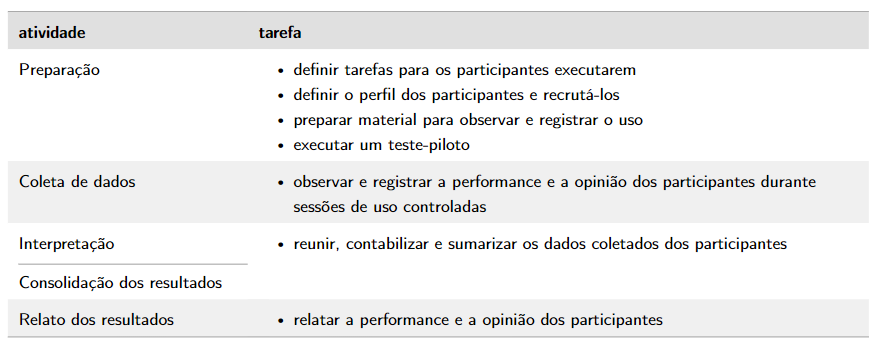

Figura 1 - Atividades do teste de usabilidade (Fonte: Simone [<a href="#referencia-bibliografia">3</a>] )

## Preparação 
Os protótipos seguem o [guia de estilo](../../AnaliseRequisitos/guia-de-estilo.md), para delimitar as interfaces de forma mais concreta. Além, é claro, das  [tarefas definidas](../planejamento_Prototipopapel/#tarefas) durante a preparação do teste de usabilidade, que são:

1. [Buscar local](#buscar-local);
2. [Cadastrar Ponto de Referência](#cadastrar-ponto-de-referencia);
3. [Compartilhar localização em tempo real](#compartilhar-localizacao-em-tempo-real);
4. [Cadastrar Estrada](#cadastrar-estrada);
5. [Explorar local turístico](#explorar-local-turistico);

<!-- 1. [Buscar local](../../../AnaliseRequisitos/analiseTarefas/#tarefa-2-buscar-locais-desejados);
1. [Cadastrar Ponto de Referência](../../../AnaliseRequisitos/analiseTarefas/#tarefa-1-cadastrar-ponto-de-referencia);
2. [Compartilhar localização em tempo real](../../../AnaliseRequisitos/analiseTarefas/#tarefa-4-compartilhar-localizacao-em-tempo-real);
3. [Cadastrar Estrada](../../../AnaliseRequisitos/analiseTarefas/#tarefa-3-adicionar-uma-nova-estrada);
4. [Explorar local turístico](../../../AnaliseRequisitos/analiseTarefas/#tarefa-5-explorar-local-turistico). -->

## Protótipos de Papel

Durante a produção dos protótipos, foi criado o protótipo 0, conforme as Figuras 2 a 7 e os Vídeos 1 e 2. O qual representada a tarefa de buscar local do site OpenStreetMap fugindo do objetivo do teste de usabilidade, pois não apresenta a alternativa de design feitas pelo grupo e possui outras tarefas dentro do protótipo (como realizar login e buscar local). Dessa forma, os demais protótipos foram corrigidos e adequados. Porém, serve de comparação para ver a eficiência das novas propostas.

Protótipo 0

<table class="no-border">
  <thead>
    <tr>
    </tr>
  </thead>
  <tbody>
    <tr>
      <td>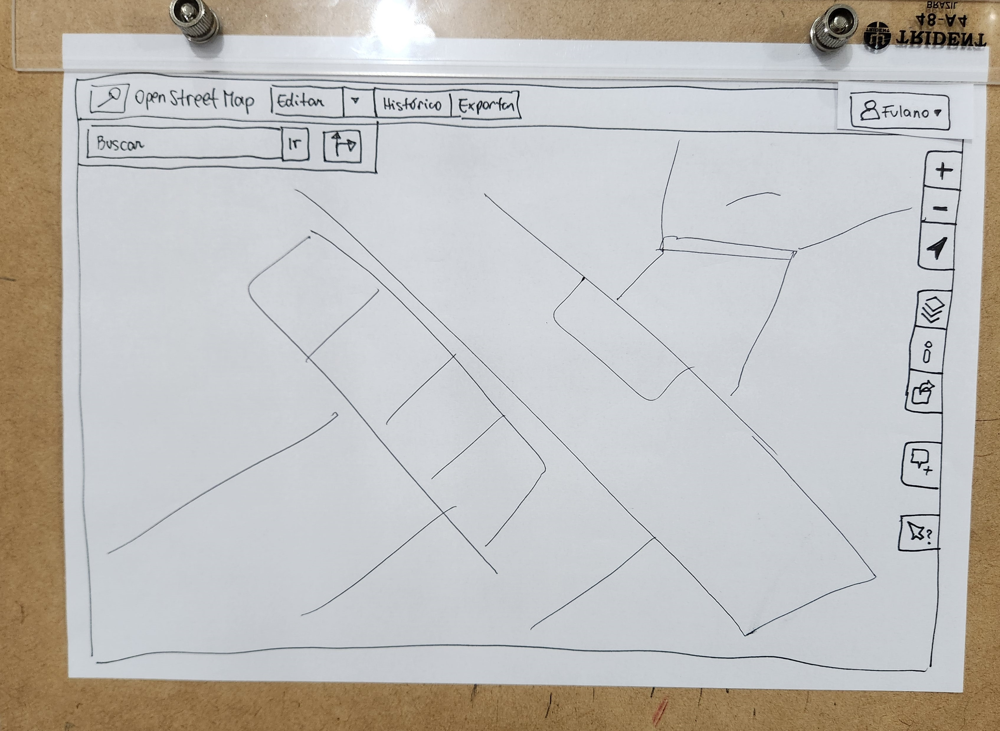</img></td>
      <td>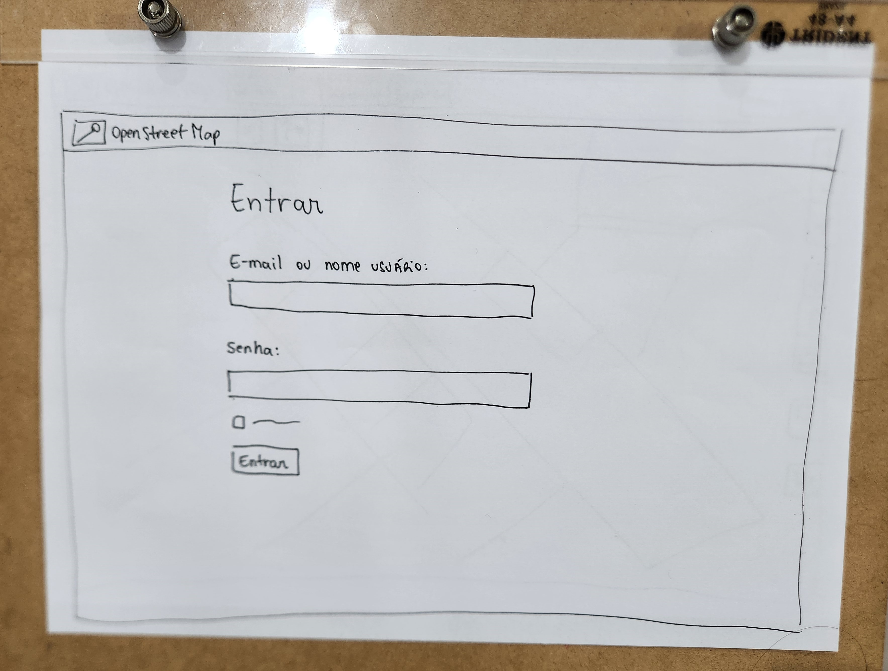</img></td>
    </tr>
    <tr>
      <td align="center">Figura 2: Janela principal (Fonte: Raquel, 2023).</td>
      <td align="center">Figura 3: Janela login (Fonte: Raquel, 2023).</td>
    </tr>
    <tr>
      <td> </td>
      <td> </td>
    </tr>
    <tr>
      <td>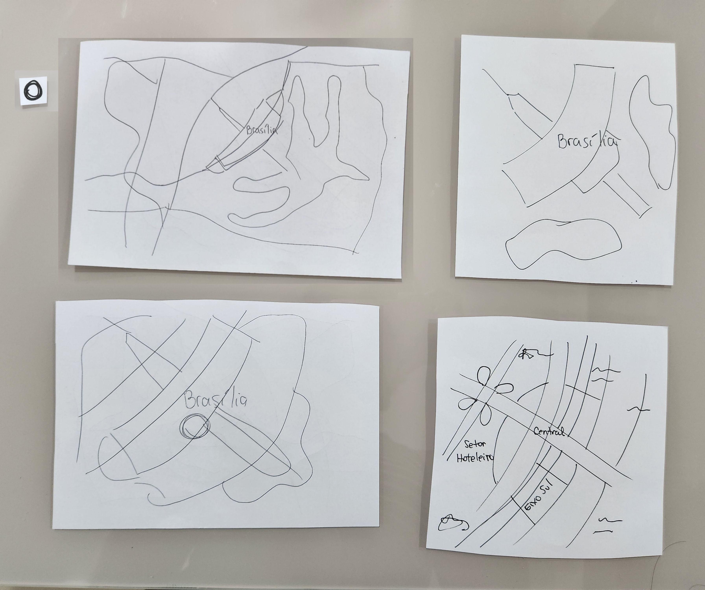</img></td>
      <td>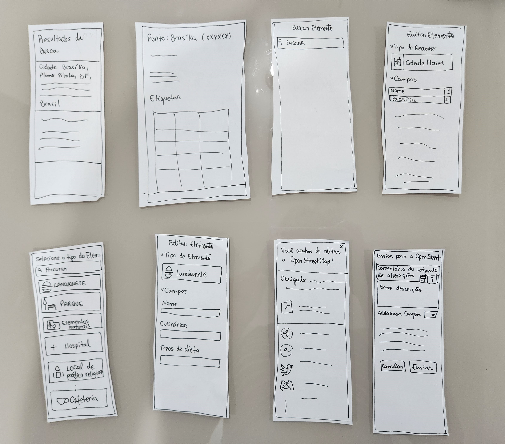</img></td>
    </tr>
    <tr>
      <td align="center">Figura 4: Mapas (Fonte: Raquel, 2023)</td>
      <td align="center">Figura 5: Barras laterais (Fonte: Raquel, 2023)</td>
    </tr>
    <tr>
      <td> </td>
      <td> </td>
    </tr>
  </tbody>
</table>

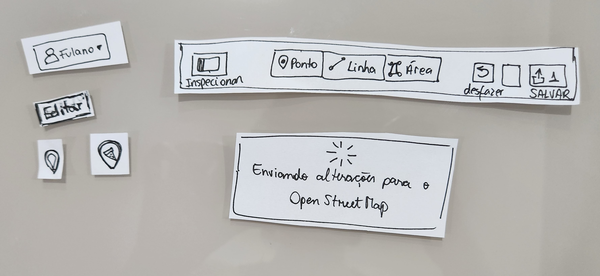</img>

 Figura 6: Componentes (Fonte: Raquel, 2023).

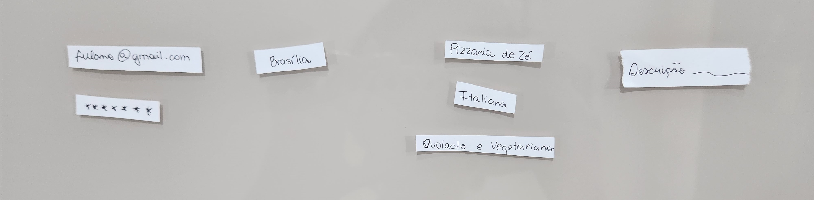</img>

 Figura 7: Inputs (Fonte: Raquel, 2023).

<iframe width="650" height="405" src="https://www.youtube.com/embed/diwnWaYMBiw" title="YouTube video player" frameborder="0" allow="accelerometer; autoplay; clipboard-write; encrypted-media; gyroscope; picture-in-picture; web-share" allowfullscreen></iframe>

 Vídeo 1: Teste Piloto (Fonte: Raquel, 2023).

<iframe width="650" height="405" src="https://www.youtube.com/embed/ns1IIUtlCeA" title="YouTube video player" frameborder="0" allow="accelerometer; autoplay; clipboard-write; encrypted-media; gyroscope; picture-in-picture; web-share" allowfullscreen></iframe>

 Vídeo 2: Teste de Usabilidade (Fonte: Raquel, 2023).

### Buscar Local

### Cadastrar Ponto de Referência
O protótipo da [Tarefa 2 - Cadastrar Ponto de Referência](../../../AnaliseRequisitos/analiseTarefas/#tarefa-2-buscar-locais-desejados) está representado nas Figuras 8 a 14.

<table class="no-border">
  <thead>
    <tr>
    </tr>
  </thead>
  <tbody>
    <tr>
      <td></img></td>
      <td></img></td>
    </tr>
    <tr>
      <td align="center">Figura 8: Janela principal, edição (Fonte: Raquel, 2023, 2023).</td>
      <td align="center">Figura 9: Seleção da edição (Fonte: Raquel, 2023, 2023).</td>
    </tr>
    <tr>
      <td> </td>
      <td> </td>
    </tr>
    <tr>
      <td></img></td>
      <td></img></td>
    </tr>
    <tr>
      <td align="center">Figura 10: Seleção do tipo do elemento (Fonte: Raquel, 2023)</td>
      <td align="center">Figura 11: Seleção do tipo do elemento (Fonte: Raquel, 2023)</td>
    </tr>
    <tr>
    <tr>
      <td> </td>
      <td> </td>
    </tr>
    <tr>
      <td></img></td>
      <td></img></td>
    </tr>
    <tr>
      <td align="center">Figura 12: Informações do ponto (Fonte: Raquel, 2023)</td>
      <td align="center">Figura 13: Comentário da edição (Fonte: Raquel, 2023)</td>
    </tr>
    <tr>
      <td> </td>
      <td> </td>
    </tr>
  </tbody>
</table>

</img>

 Figura 14: Pop-up (Fonte: Raquel, 2023).

### Compartilhar localização em tempo real

### Cadastrar Estrada

### Explorar local turístico

Outro protótipo que será apresentados é o referente a [Tarefa 5 - Explorar local turístico](../../../AnaliseRequisitos/analiseTarefas/#tarefa-5-explorar-local-turistico) que esta representado nas FIguras 15, 16, 17 e 18.

<table class="no-border">
  <thead>
    <tr>
    </tr>
  </thead>
  <tbody>
    <tr>
      <td>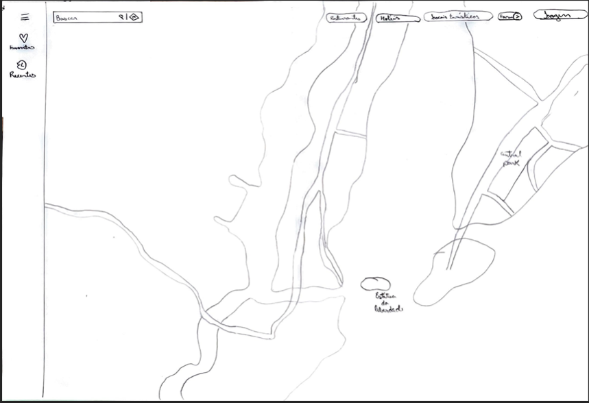</img></td>
      <td>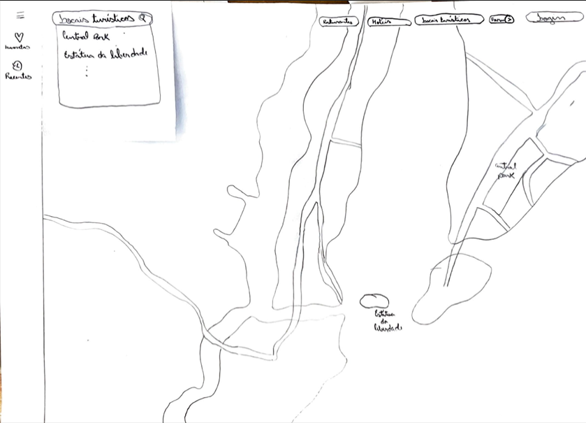</img></td>
    </tr>
    <tr>
      <td align="center">Figura 15: Janela principal (Fonte: Guilherme, 2023, 2023).</td>
      <td align="center">Figura 16: Lista locais turísticos (Fonte: Guilherme, 2023).</td>
    </tr>
    <tr>
      <td> </td>
      <td> </td>
    </tr>
    <tr>
      <td>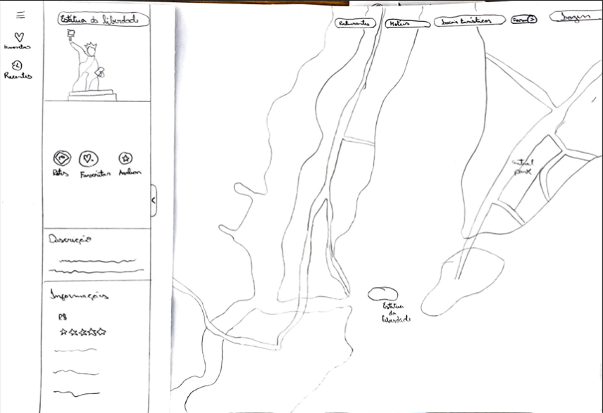</img></td>
      <td>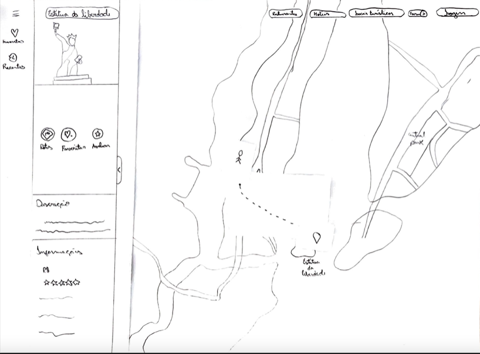</img></td>
    </tr>
    <tr>
      <td align="center">Figura 17: Local turístico selecionado (Fonte: Guilherme, 2023)</td>
      <td align="center">Figura 18: 10: Rota (Fonte: Guilherme, 2023)</td>
    </tr>
  </tbody>
</table>

## Teste Piloto
Uma das etapas finais da preparação é a realização do teste piloto. Ele é realizado com o objetivo de identificar possíveis problemas nos protótipos, assegurar que o protótipo será disponibilizado para o participante, além de verificar a possibilidade de realizar o teste no ambiente programado. Os seus resultados serão utilizados para aprimorar o roteiro e a abordagem geral. No [Relato dos Resultados do Protótipo de Papel](../relatos/#teste-piloto) será apresentado o teste piloto realizado.

## Referência Bibliografia

> [1] Rubin, Jeffrey (1994). Handbook of Usability Testing: How to Plan, Design, and Conduct Effective Tests. John Wiley & Sons, Inc., USA, 1st edition.

> [2] Rubin, Jeffrey e Chisnell, Dana (2008). Handbook of Usability Testing: How to Plan, Design, and Conduct Effective Tests. Wiley, Indianapolis, IN, 2nd edition edition.

> [3] BARBOSA, Simone. D. J.; Silva, B. S. da; Silveira, M. S.; Gasparini, I.; Darin, T.; Barbosa, G. D. J. (2021) Interação Humano-Computador e Experiência do usuário. Cáp. 12, pág. 302.

## Bibliografia

> BARBOSA, Simone. D. J.; Silva, B. S. da; Silveira, M. S.; Gasparini, I.; Darin, T.; Barbosa, G. D. J. Interação Humano-Computador e Experiência do usuário, 2021.

> BARBOSA, Simone; SILVA, Bruno. Interação Humano-Computador, 1a. Edição, Editora Campus, 2010.

## Histórico de Versão
| Data | Data Prevista de Revisão | Versão | Descrição | Autor | Revisor |
| :-: | :-: | :-: | :-: | :-: | :-: 
| 12/06/2023 |        13/06/2023        |  1.0   | Criação inicial do documento | [Raquel](https://github.com/raqueleucaria) | [Caetano](https://github.com/caeslucio) |
| 03/07/2023 | 04/07/2023 | 2.0 | Adequação ao teste de usabilidade | [Raquel](https://github.com/raqueleucaria)|  [Caetano](https://github.com/caeslucio) |

-------------------------------------------------------------------------------------------------------------------
