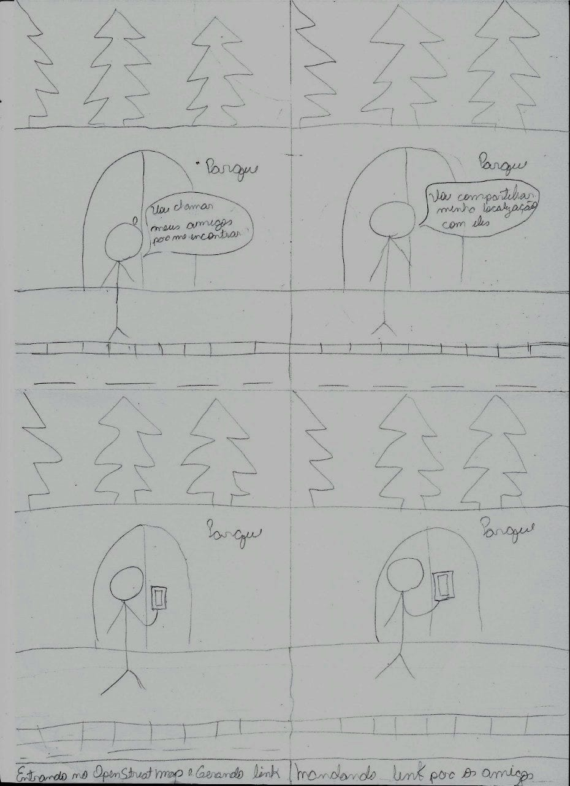

# Planejamento da Avaliação do Storyboard

## Introdução

Este artefato descreve o planejamento da avaliação do storyboard do OpenStreetMap. O storyboard é uma representação visual da interface do usuário e fluxo de interação do aplicativo. O objetivo dessa avaliação é identificar problemas de usabilidade, obter feedback dos usuários e validar conceitos de design. Para guiar a avaliação, utilizaremos o framework DECIDE, que fornece uma estrutura sistemática para o processo de avaliação de interfaces.

## Objetivo

O objetivo principal desta avaliação do storyboard do OpenStreetMap é coletar feedback dos usuários para identificar melhorias na usabilidade e eficácia do design. Especificamente, queremos avaliar a compreensão das informações, a navegabilidade, a organização da interface e a adequação às necessidades dos usuários. Os resultados da avaliação serão usados para aprimorar o storyboard e fornecer direcionamento para futuras iterações de design.

## Metodologia

A metodologia selecionada para a avaliação do storyboard será por meio de entrevistas individuais com usuários do OpenStreetMap. Essas entrevistas permitirão uma compreensão mais aprofundada das experiências e percepções dos usuários sobre o storyboard. Ao conduzir as entrevistas, serão levadas em consideração questões [éticas](../../Planejamento/Aspectos_Eticos.md). Abixo segue o termo de consentimento que será utilizado.

***Termo de Consentimento para Entrevistas e Pesquisas com Usuários***

Eu, _______________________________, concordo em participar da pesquisa de interação humano-computador da disciplina de IHC da UnB, que tem como objetivo coletar informações dos usuários do sistema OpenStreetMap para aperfeiçoar a comunicação entre seres humanos e tecnologia.

Declaro que as informações coletadas durante a pesquisa serão confidenciais e utilizadas exclusivamente para fins acadêmicos. As informações fornecidas serão armazenadas em um servidor seguro e acessadas somente pelos estudantes e professor responsáveis pela disciplina.

Concordo que minha imagem e voz possam ser gravadas durante as entrevistas e utilizadas em eventuais apresentações da pesquisa, sem que haja qualquer ônus ou indenização pelo uso dessas imagens e vozes.

Reconheço que a pesquisa será conduzida seguindo os princípios éticos da Resolução N°466 de 2012 do Conselho Nacional de Saúde, que busca assegurar os direitos e deveres dos participantes da pesquisa, bem como discorrer sobre os referenciais da bioética, apresentando quatro princípios éticos a serem seguidos: autonomia, beneficência, não maleficência e justiça e equidade.

Por fim, declaro que reconheço meu direito de recusar a participação na pesquisa a qualquer momento, sem que isso afete minha relação com a instituição ou os estudantes.

Assinatura do Participante ___________________________________

Data _________

## Avaliadores e participantes

Os participantes das entrevistas serão selecionados com base no perfil de usuário do OpenStreetMap. Os entrevistadores serão membros da equipe de IHC (Interação Humano-Computador), que com o auxílio do roteiro de perguntas irão conduzir as entrevistas. Além disso, é necessário documentar sobre os participantes do estudo, como:

- Numero de participantes 
- Critério de escolha
- Características relevantes

## Teste Piloto

Antes de iniciar a avaliação com os participantes reais, realizaremos um teste piloto com os próprios integrantes do grupo de IHC. Isso nos permitirá identificar possíveis problemas no roteiro de entrevista, ajustar o tempo necessário para cada entrevista e familiarizar-nos com o processo de condução das entrevistas.

## Cronograma

A seguir, na tabela 1, está o cronograma para as atividades que serão realizadas, sendo essas o teste piloto e as entrevistas com os participantes e personas.

| Data       | Hora  | Local           | Entrevistador | Entrevistado  | Tarefa  |
|------------|-------|-----------------|---------------|---------------| ---------------|
| 25/05/2023 | 19:30 | Online - Microsoft Teams | Paulo Victor        | Guilherme Kishimoto     | Teste piloto   |
| 25/05/2023 | 20:00 | Online - Microsoft Teams | Paulo Victor          | Lucas Oliveira Martins  | Entrevista   |
| 25/05/2023 | 20:00 | Online - Microsoft Teams | Raquel Eucaria         | Gabriel Souza Pereira    | Entrevista  |
| 25/05/2023 | 20:00 | Online - Microsoft Teams | Daniel dos Santos         | João Pedro    | Entrevista  |

 Tabela 1: Cronograma  (Fonte: autor, 2023).

## Roteiro de Entrevista
Durante as entrevistas, será fornecida uma breve explicação do storyboard do OpenStreetMap, destacando sua função de representar a interface e o fluxo de interação do aplicativo. Também será explicado que o storyboard serve como base para avaliar a usabilidade e identificar áreas de melhoria. Em seguida, será mostrado os storyboards do OpenStreetMap e serão feitas as seguintes peguntas da tabela 2:

| ID       | Pergunta  | Objetivo 
|------------|-------|-----------------|
| P01 | Você consegue entender o propósito e funcionalidade do storyboard do OpenStreetMap? | Verificar a compreensão    |
| P02 | As informações apresentadas no storyboard são claras e fáceis de entender? |   Verificar a compreensão    |
| P03 | Você encontrou alguma dificuldade específica ao interagir com as telas do storyboard?  | Verificar a compreensão    |
| P04 | O storyboard apresenta um fluxo lógico de interações entre as telas? |  Verificar fluxo de interação  |
| P05 | As telas do storyboard fornecem informações relevantes para a realização das tarefas? |  Verificar usabilidade das telas  |
| P06 | O storyboard apresenta tarefas condizentes com a realidade? |  Verificar usabilidade das telas  |
| P07 | O ator principal conseguiu encontrar e utilizar as funcionalidades necessárias para alcançar seu objetivo? |  Verificar a usabilidade e a eficácia do storyboard  |

 Tabela 2: Perguntas  (Fonte: autor, 2023).

## Storyboard

Um storyboard é uma representação visual sequencial de uma história ou narrativa que ilustra a interação entre um usuário e um sistema de uma forma simples. Ele ajuda a visualizar e comunicar o funcionamento de uma interface de forma clara, facilitando a identificação de problemas e melhorias no design.

Na figura 1, podemos ver o storyboard de compartilhar localização.

 Figura 1: Storyboard compartilhar localização  (Fonte: autor, 2023).

## Interpretação

Após a conclusão das entrevistas, serão analisados os resultados coletados. A interpretação levará em consideração os comentários dos participantes, identificando tendências e padrões. Serão destacadas as principais áreas de melhoria e fornecidas recomendações para aprimorar o storyboard do OpenStreetMap com base nos insights obtidos durante a avaliação.

Esperamos que este planejamento da avaliação do storyboard do OpenStreetMap proporcione uma compreensão mais aprofundada das experiências dos usuários e direcione melhorias significativas na interface do aplicativo.

## Avaliação dos Resultados

Os resultados obtidos por meio das avaliações planejadas no cronograma serão analisados conforme descrito no documento de [Planejamento do Relato de Resultados](/planejamento_relato.md).

## Bibliografia

[1] BARBOSA, SIMONE DINIZ JUNQUEIRO; SILVA, BRUNO SANTANA DA, Interação Humano-Computador, 1ª Edição, Editora Campus, 2010

## Histórico de Versão
|    Data    | Data Prevista de Revisão | Versão |      Descrição       |                                                                Autor                                                                 |               Revisor               |
| :--------: | :----------------------: | :----: | :------------------: | :----------------------------------------------------------------------------------------------------------------------------------: | :---------------------------------: |
| 20/05/2023 |        21/05/2023        |  1.0   | Criação do documento | [Guilherme](https://github.com/guilhermekishimoto) | [Raquel](https://github.com/raqueleucaria) |