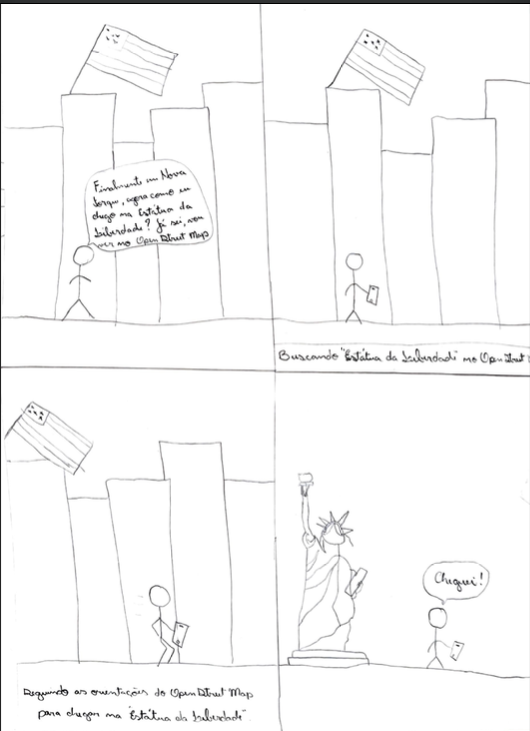
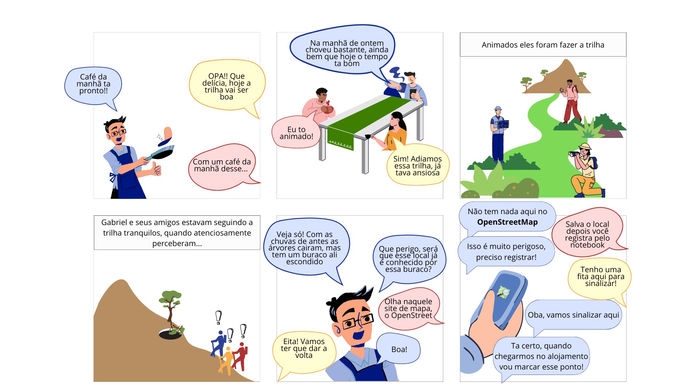

# Planejamento da Avaliação do Storyboard

## Introdução

Este artefato descreve o planejamento da avaliação do storyboard do OpenStreetMap. O objetivo dessa avaliação é identificar obter feedback dos usuários. Para guiar o planejamento da avaliação, utilizaremos o framework DECIDE.

## Metodologia
O planejamento da Avaliação do Storyboard será conduzido através do uso do Framework DECIDE, onde cada letra representa uma fase específica do planejamento, na tabela 1 é possível visualizar o que cada letra representa.

 

| Letra |                             Definição                              |
| :---: | :----------------------------------------------------------------: |
|   D   |            Determinar os objetivos da avaliação de IHC             |
|   E   |     Explorar as perguntas a serem respondidas com a avaliação      |
|   C   |  (*Chose*) Escolher os métodos que serão utilizados na avaliação   |
|   I   |    Identificar e administrar as questões práticas da avaliação     |
|   D   |             Decidir como lidar com as questões éticas              |
|   E   | (*Evaluate*) Interpretar e apresentar os dados da avaliação de IHC |

Tabela 1 - Metodologia DECIDE (Fonte: Autor, 2023)

 

## D - Objetivos

O objetivo principal desta avaliação dos Storyboards do OpenStreetMap é coletar feedback dos usuários para uma melhor compreensão sobre o contexto em que o sistema avaliado se insere, quais os objetivos e as necessidades dos usuários, como os usuários costumam alcançá-los e como elas afetam sua vida pessoal e profissional.

## E - Perguntas a Serem Respondidas
Levando em consideração os objetivos da avaliação, deverão ser respondidas as seguintes perguntas para que seja possível alcançar os objetivos, as perguntas são:

- O storyboard reflete adequadamente o contexto em que o sistema será utilizado? 

- O storyboard representa com precisão as situações e cenários em que os ator interage com o sistema?

- O storyboard apresenta os objetivos do ator de forma clara e compreensível? É possível identificar facilmente quais são os principais objetivos que o ator busca alcançar ao utilizar o sistema?

- As necessidades do ator são abordadas de maneira satisfatória no storyboard? O storyboard evidencia os problemas e desafios que o ator enfrenta e mostra como o sistema pode atender às suas necessidades?

## C - Métodos de Avaliação
O método de avaliação escolhido para a avaliação foi o de investigação por meio de entrevistas, onde um integrante do grupo 4 da disciplina de IHC realizará algumas perguntas para o usuário.

## I - Questões Práticas

### Recrutamento dos Prticipantes
Os participantes serão selecionados utilizando como base o [perfil de usuário](../../AnaliseRequisitos/perfil_usuario.md) elicitado. A quantidade de participantes será de 3 pessoas, sendo esse um número adequado segundo Krug.

### Tarefas
As avaliações utilizarão Storyboards com as seguintes tarefas:

1. Compartilhar localização em tempo real;

2. Buscar local turístico;

3. Cadastrar Ponto de Referência.

### Custos e Ferramentas
As avaliações devem ser feitas de modo que a equipe e os participantes (usuários) tenham gastos mínimos ou não tenham custos. Para isso, será utilizado as seguintes ferramentas:

- Computador;

- Microfone;

- Celular;

- Microsoft Teams;

- Storyboard;

- Roteiro de Avaliação.

### Teste Piloto

Antes de iniciar a avaliação com os participantes reais, realizaremos um teste piloto com os próprios integrantes do grupo de IHC. Isso nos permitirá identificar possíveis problemas no roteiro de entrevista, ajustar o tempo necessário para cada entrevista e verificar se todas as ferramentas estão funcionando corretamente.

## Cronograma

A seguir, na tabela 2, está o cronograma para as atividades que serão realizadas, sendo essas o teste piloto e as entrevistas com os participantes e personas.

| Data       | Hora  | Local           | Entrevistador | Entrevistado  | Tarefa  |
|------------|-------|-----------------|---------------|---------------| ---------------|
| 25/05/2023 | 19:30 | Online - Microsoft Teams | Paulo Victor        | Guilherme Kishimoto     | Teste piloto   |
| 25/05/2023 | 20:00 | Online - Microsoft Teams | Paulo Victor          | Lucas Oliveira Martins  | Entrevista   |
| 25/05/2023 | 20:00 | Online - Microsoft Teams | Raquel Eucaria         | Gabriel Souza Pereira    | Entrevista  |
| 25/05/2023 | 20:00 | Online - Microsoft Teams | Daniel dos Santos         | João Pedro    | Entrevista  |

 Tabela 2: Cronograma  (Fonte: autor, 2023).

### D - Questões Éticas
Durante todo o processo de avaliação, serão consideradas [questões éticas](../../Planejamento/Aspectos_Eticos.md), incluindo privacidade, consentimento informado e confidencialidade dos participantes. Será fornecido um [termo de consentimento](../../Planejamento/Aspectos_Eticos.md) para os participantes no qual eles concordarão em participar da avaliação e permitir a gravação das sessões, garantindo que suas informações sejam utilizadas apenas para fins acadêmicos e que sua identidade seja protegida. Além disso, durante a gravação será perguntado e confirmado sobre o consentimento do participantes.

### Roteiro de Avaliação
O avaliador deve ser cordial e deixar os participantes bem à vontade. O avaliador deve explicar ao participante os objetivos do estudo, o sistema de interesse, o procedimento da avaliação e as questões éticas. Em seguida serão realizadas as perguntas pré-teste, o teste de usabilidade e as perguntas pós-teste. A tabela 3 apresenta as perguntas pré-teste e a tabela 4 apresenta as perguntas pós-teste.

| Número | Perguntas | Opções de resposta |
| --- | --- | --- |
| 1 | Qual a sua idade? | Aberta |
| 2 | Qual o seu nível de formação acadêmica atual? | Aberta |
| 3 | Qual o seu nível de experiência com tecnologias? | [ ]Alto  [ ]Médio   [ ]Baixo |
| 4 | Qual o seu nível de experiência com o OpenStreetMap? | [ ]Alto  [ ]Médio   [ ]Baixo  [ ]Nenhum |

Tabela 3 - Perguntas Pré-teste (Fonte: Autor, 2023)

 

| Número | Perguntas | Opções de resposta |
| --- | --- | --- |
| 1 | Você consegue se imaginar utilizando o sistema com base no storyboard? | [ ]Sim  [ ]Não |
| 2 | Existe alguma parte do storyboard que você considera confusa ou difícil de entender? Qual? | Aberta |
| 3 | O storyboard representa de maneira adequada as atividades que o ator realiza no sistema?  | [ ]Sim  [ ]Não |
| 4 | Você acha que o ator realizou a principal tarefa proposta do Storyboard?  | [ ]Sim  [ ]Não |

Tabela 4 - Perguntas Pós-teste (Fonte: Autor, 2023)

## E - Interpretação e Resultados dos Dados
Os avaliadorem interpretam os dados coletados de cada participante individualmente, buscando respostas às questões definidas no planejamento da avaliação. Em seguida, após a interpretação dos dados, os avaliadores irão discutir os resultados buscando recorrências nos resultados e assim deve-se chegar em resultados comuns, que serão documentados e poderão ser utilizados para melhorias nos Storyboards.

## Resultado do Teste Piloto
Após a realização do teste piloto, identificamos que estava tudo certo com o escopo da entrevista. Abaixo, no Iframe 1, está o vídeo do teste piloto.

<iframe width="650" height="405" src="https://www.youtube.com/embed/s0Qh0cIOUyM" title="YouTube video player" frameborder="0" allow="accelerometer; autoplay; clipboard-write; encrypted-media; gyroscope; picture-in-picture; web-share" allowfullscreen></iframe>

Iframe 1: Teste Piloto. (Fonte: Autores, 2023) 

## Storyboard

Um storyboard é uma representação visual sequencial de uma história ou narrativa que ilustra a interação entre um usuário e um sistema de uma forma simples. Ele ajuda a visualizar e comunicar o funcionamento de uma interface de forma clara, facilitando a identificação de problemas e melhorias no design.

Na figura 1, podemos ver o storyboard de compartilhar localização.

 Figura 1: Storyboard compartilhar localização  (Fonte: autor, 2023).

Na figura 2, podemos ver o storyboard de buscar locais turísticos.

 Figura 2: Storyboard buscar locais turísticos  (Fonte: Guilherme, 2023).

Na figura 3, podemos ver o storyboard cadastro de ponto de referência.

 Figura 3: Storyboard Cadastro de Ponto de Referência  (Fonte: Raquel, 2023).

## Interpretação (E)

Após a conclusão das entrevistas, serão analisados os resultados coletados. A interpretação levará em consideração os comentários dos participantes, identificando tendências e padrões. Serão destacadas as principais áreas de melhoria e fornecidas recomendações para aprimorar o storyboard do OpenStreetMap com base nos insights obtidos durante a avaliação.

Esperamos que este planejamento da avaliação do storyboard do OpenStreetMap proporcione uma compreensão mais aprofundada das experiências dos usuários e direcione melhorias significativas na interface do aplicativo.

## Avaliação dos Resultados (E)

Os resultados obtidos por meio das avaliações planejadas no cronograma serão analisados conforme descrito no documento de [Planejamento do Relato de Resultados](/planejamento_relato.md).

## Bibliografia

> Barbosa, S. D. J.; Silva, B. S. da; Silveira, M. S.; Gasparini, I.; Darin, T.; Barbosa, G. D. J. (2021) Interação Humano-Computador e Experiência do usuário.

> Courage, C. & Baxter, K. Understanding your users: a practical guide to user requirements, methods, tools, and techniques. San Francisco, CA: Morgan Kaufmann Publishers, 2005.

## Histórico de Versão
|    Data    | Data Prevista de Revisão | Versão |      Descrição       |                                                                Autor                                                                 |               Revisor               |
| :--------: | :----------------------: | :----: | :------------------: | :----------------------------------------------------------------------------------------------------------------------------------: | :---------------------------------: |
| 20/05/2023 |        21/05/2023        |  1.0   | Criação do documento | [Guilherme](https://github.com/guilhermekishimoto) | [Raquel](https://github.com/raqueleucaria) |
| 19/06/2023 |        19/06/2023        |  2.0   | Correção do documento | [Guilherme](https://github.com/guilhermekishimoto) | [Raquel](https://github.com/raqueleucaria) |
| 30/06/2023 |        01/07/2023        |  3.0   | Refatoração do artefato | [Guilherme](https://github.com/guilhermekishimoto)| [Raquel](https://github.com/raqueleucaria) |