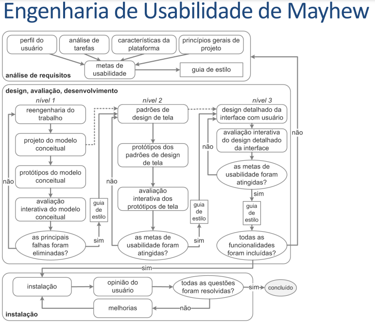

# Processo De Design

## Introdução:

Primeiramente é necessário mencionar que o processo de design para a interação humano computador é uma abordagem sistemática para projetar sistemas que possuam interfaces efetivas, eficientes e agradáveis para o usuário. Dessa forma, faz-se necessário a criação de etapas que formem um processo que possuam atividades básicas, como:

- Análise da situação atual: essa etapa busca entender as necessidades e o objetivo dos usuários do sistema, sendo assim formada através do perfil do usuário.
- Síntese de uma intervenção: nessa etapa ocorre a intervenção pós a análise da situação atual, nessa etapa ocorrem coisas como definição de requisitos, soluções de design, prototipação, entre outras.
- Avaliação da nova situação: Por fim, essa atividade permite verificar o efeito que ocorreu na síntese de uma intervenção, em que é avaliado o antes e depois da intervenção.

Sendo assim, levando em consideração a importância da criação desse artefato, abaixo será mostrada a escolha do grupo do processo de design utilizado.

## Ciclo de Vida Escolhido

Um ciclo de vida é uma abordagem que descreve as diferentes fases que um projeto de interface deve passar, da concepção até a manutenção.
Dessa forma, o grupo fez uma analise do Ciclos de Vida Simples, do Ciclo de Vida em Estrela, dos metodos de Engenharia de Usabilidade de Nielsen, e da Engenharia de Usabilidade de Mayhew, que foi o escolhido para ser utilizado na matéria.

## Ciclo de Vida de Mayhew

O Ciclo de Vida de Mayhew foi proposto  por Deborah J. Mayhew, uma educadora americana especialista na área de usabilidade e interação humano computador, e o ciclo de vida dela pode ser encontrado na figura 1.

Imagem 1: Ciclo de Mayhew. (Fonte: autor, 2023).

## Etapas do ciclo de vida
- Análise de requisitos: Esta etapa engloba o planejamento geral do projeto, em que são definidos os objetivos do sistema, identificado as necessidades dos usuários, e definido os critérios de aceitação. Além disso também é realizado a analise do perfil do usuário , em que são coletadas informações do usuário, como habilidades, tarefas, dificuldades, e necessidades. também são identificados requisitos de interface.

- Design/avaliação/desenvolvimento: Esta etapa engloba a criação, avaliação e desenvolvimento do design do software com base nos requisitos identificados na fase anterior. Essas etapas são complementares, com feedback constante entre elas para garantir que o design do software seja viável e atenda às necessidades dos usuários.

- Instalação : esta é a etapa final, em que geralmente é focada no feedback final do usuário. geralmente é onde o produto passa pelos usuários finais, onde é realizado os testes de sistema, para detectar problemas e resolve-los antes da release final, além da realização de melhorias pontuais no produto. Caso o produto possua todas as descrições solicitadas na análise de requisitos, o produto será dado como concluido.

## Motivo de escolha
Levando em consideração os ciclos de vida apresentados, o de Mayhew foi escolhido devido ao fato dele enfatizar a interação com o usuário no processo de design e desenvolvimento do produto, o que facilita que as necessidades do usuario sejam atendidas. Esse ciclo  também oferece um conjunto abrangente de etapas que permitem que o projeto seja gerenciado de forma mais completa e eficaz, além de ser um modelo flexível e adaptável.
## Bibliografia

[1] BARBOSA, SIMONE DINIZ JUNQUEIRO; SILVA, BRUNO SANTANA DA, Interação Humano-Computador, 1ª Edição, Capítulo 4, Editora Campus, 2010
 
[2] Wiki interacao-humano-computador - Planejamento - Modelo de Design. Disponível em: <https://interacao-humano-computador.github.io/2022.2-SimplesNacional/Planejamento/ModeloDesign/>. Acesso em: 20 de abril de 2023.  

## Histórico de Versão

|    Data    | Data Prevista de Revisão | Versão |      Descrição       |                                                                Autor                                                                 |               Revisor               |
| :--------: | :----------------------: | :----: | :------------------: | :----------------------------------------------------------------------------------------------------------------------------------: | :---------------------------------: |
| 20/04/2023 |        21/04/2023        |  1.0   | Adição do processo de design do projeto  | [Daniel](https://github.com/daniel-de-sousa), [Guilherme](https://github.com/guilhermekishimoto) e [Paulo](https://github.com/PauloVictorFS) | [Raquel](https://github.com/raqueleucaria) |