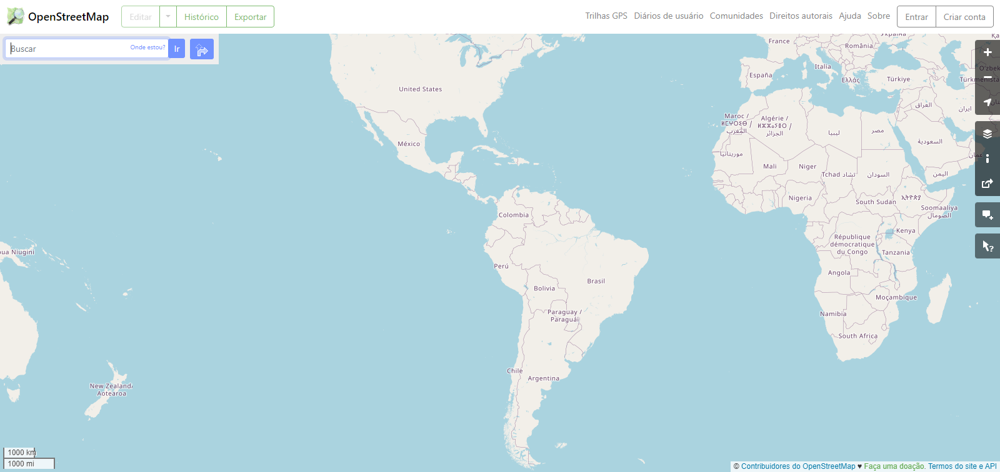
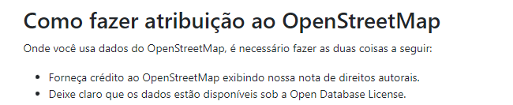

# Site Escolhido

## Sites analisados

Para a escolha do site, cada integrante realizou uma avaliação de um site que se enquadrava nas possíveis escolhas para o projeto atráves das heurísticas de Nielsen. Dessa forma, Com base nisso o grupo se baseou e escolheu a que fosse de maior agrado. Sendo assim, na tabela 1 estão listados os sites escolhidos por cada integrante e, logo mais, as análises realizadas pelos mesmos.

| Nome                | Site                  | 
| :-----------------: | :-------------------: |  
| Carla de Araujo     | Open Street Map       | 
| Daniel dos Santos   | CAESB Autoatendimento | 
| Guilherme Kishimoto | Lattes                | 
| Paulo VIctor        | LibreOffice           |  

Tabela 1: Sites que foram analisados (Fonte: Autores).

## Critério Para a Definição do Site

Após a seleção individual de cada integrante, o grupo decidiu o site a partir dos seguintes critérios:

- O site não poderia ter sido trabalhado anteriormente na disciplina de Interação Humano Computador
- O site precisa ser um software livre ou do governo, e deve permitir a mudança e análise para fins educacionais
- O site deve possuir algum tipo de defeito na usabilidade, interface ou outros locais que permita uma manuseabilidade maior

## Motivos de Escolha
Depois que o site passou nos critérios da disciplina, o site escolhido foi o OpenStreetMap, pelos seguintes motivos:

- O site apresenta uma usabilidade ruim
- O site não apresenta ferramentas de acessibilidade
- O site não possui um esquema de segurança para a verificação das rotas
- O site apresenta quebra de padrões de algumas páginas
- O site não possui tantas informações, o que possibilita que seja proposto um design mais simples melhorando e adicionando ferramentas de acessibilidade

Diante de todos esses requisitos, o site escolhido foi o OpenStreetMap

## Usuários
Se tratando de um site que fornece serviço de localização e trilhas, seus usuários são do tipo que podarem apresentaram as seguintes características, entre outras existentes:

- Gostam de realizar trilhas ao ar livre.
- Querem conhecer outras rotas para otimizar tempo.
- Querem contribuir para a comunidade.
- Usam os pontos de referência registrados para se localizar.

## OpenStreetMap
Link do site: <a href="https://www.openstreetmap.org/" target="_blank">Open Street Map</a>

OpenStreetMap é um site que fornece informações sobre estradas, trilhas, alguns estabelecimentos, estações, entre outros. Dentro dele o usuário pode tanto achar uma rota como também pode criar uma, sendo que para isso, uma das permissões que devem ser concedidas para ele é a da localização. Sendo que para que funcione assim, o site conta com um sistema de cadastro e login.
A figura 1 abaixo apresenta a tela inicial do site.

Figura 1 - Home do OpenStreatMap. (Fonte: Autores)

## Permissão
O Site OpenStreetMap é um software livre, que permite análise e utilização do software, desde que seja dado crédito a organização, conforme comprovado pela figura 2:

Figura 2 - Permissões do OpenStreatMap. (Fonte: Autores)

## Bibliografia

> MACIEL, Cristiano; NOGUEIRA, José Luis T.; CIUFFO, Leandro Neumann; GARCIA, Ana Cristina Bicharra. Avaliação Heurística de Sítios na Web. Instituto de Computação - Universidade Federal Fluminense - UFF, Niterói - RJ 

## Histórico de Versão
|    Data    | Data Prevista de Revisão | Versão |      Descrição       |                                                                Autor                                                                 |               Revisor               |
| :--------: | :----------------------: | :----: | :------------------: | :----------------------------------------------------------------------------------------------------------------------------------: | :---------------------------------: |
| 20/04/2023 |        20/04/2023        |  1.0   | Criação do documento | [Daniel](https://github.com/daniel-de-sousa) e [Paulo](https://github.com/PauloVictorFS)  | [Carla](https://github.com/ccarlaa) |
| 17/05/2023 |        17/05/2023        |  1.1   | Correção de Alguns pontos e adicionando legendas | [Daniel](https://github.com/daniel-de-sousa) | [Paulo](https://github.com/PauloVictorFS) |