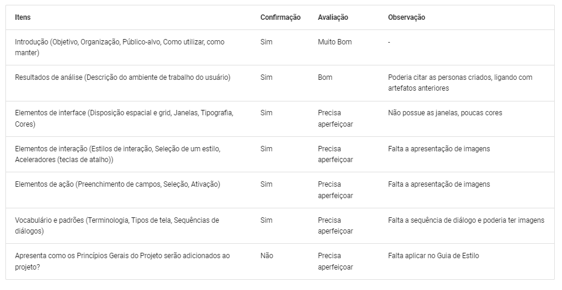
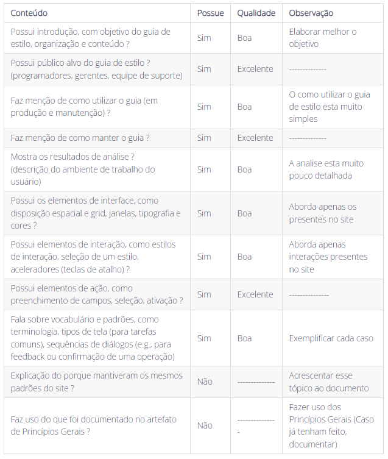

# Guia de Estilo
## Introdução
Segundo a norma internacional ISO/IEC/IEEE 12207:2017(E) (ISO/IEC/IEEE, 2017, p. 82) [1], o objetivo da verificação se define em "prover evidência objetiva que o sistema ou elemento do sistema atende completamente seus requisitos e características especificados". Com isso, afim de garantir qualidade e consistência dos requisitos, realizaremos a verificação dos documentos do nosso grupo, [OpenStreetMap](https://interacao-humano-computador.github.io/2023.1-OpenStreetMap/)[2], da disciplina Requisitos de Software.

## Objetivos
O objetivo deste documento é realizar a verificação do Guia de Estilo, artefato da Entrega 3, do Grupo 4 ([OpenStreetMap](https://requisitos-de-software.github.io/2023.1-Caesb/)). De forma impessoal, este documento não deseja avaliar os membros do grupo, mas o artefato em si.

## Metodologia
Como método de investigação e produção da verificação, utilizaremos a inspeção, mais especificamente a _Fagan Inspection_. Na qual, segundo Bush [3], consiste na "inspeção de documentos entendidos como prontos para uso e busca por defeitos". Seguindo as etapas de planejamento, visão geral, preparação, inspecção e correção. Maiores detalhes de planejamento, estão apresentados no [Planejamento da Entrega 3](./0planejamento.md)

## Verificações anteriores
Uma das atividades da disciplina de Interação Humano Computador, ministrada pelo professor André Barros, é realizar a verificação do projeto de outro grupo. A nossa verificação foi feita sobre o Guia de Estilo do grupo 5 ([Alistamento Militar](https://interacao-humano-computador.github.io/2023.1-OpenStreetMap/Verificacao/grupo5/ponto3/)), conforme a figura 1. E o grupo 3 ([Banco Central](https://interacao-humano-computador.github.io/2023.1-BancoCentral/#/verificacao/ponto_controle_3/guia_estilo_g4)), fez a inspeção do nosso projeto (OpenStreeMap), conforme a Figura 2. 

Dessa forma, reavaliamos nosso checklist, levando em conta os pontos levantados pelo grupo 3, e baseando-se nas literaturas de referência. Assim, um novo checklist foi criado para a avaliação do nosso próprio guia.

</img>

Figura 1 - Checklist Guia de Estilo - Grupo 4 (Fonte: Autores)

</img>

Figura 2 - Checklist Guia de Estilo - Grupo 3 (Fonte: Autores)

## Checklist
<!-- LIVRO BASE PARA CRIAÇÃO DAS PERGUNTAS -->
Os checklists foram estabelecido com base nos critérios da literatura Guia de Estilos BI[4], Style Guide[5] e, como citado anteriormente, nas verificações realizadas anteriormente, pelo nosso grupo, OpenStreetMap[6] e pelo Grupo 3, Banco Central[7]. Além das perguntas padrões estabelecidas no [Planejamento Geral](../0planejamento-geral.md).

<!-- 
 -->
<!-- ADICIONAR O CHECKLIST OU OS CHECKLISTS DA ENTREGA REFERENTE -->
| ID| Descrição | Avaliação | Observação |
|---|---|---|---
| 1 | O artefato possui uma introdução condizente com o conteúdo do texto? || |
| 2 | Todas as bibliografias/referências bibliográficas são utilizadas de forma correta? |  |  |
| 3 | Todas as tabelas e figuras são chamadas no texto, possuem legendas e fontes? |  ||
| 4 | A metodologia esta de acordo com o artefato analisado? |  | |
| 5 | Pergunta x? |  |  |
| 6 | Pergunta y? Se necessário trazer a explicar dos termos citados, no mesmo espaço da pergunta. |  |  |

Tabela 1 - Chacklist Guia de Estilo (Fonte: Autores)
<!-- 
 -->

## Observações

## Correções
Com base na inspeção realizada, passaremos para o processo de correção. O qual identificaremos os itens a serem corrigidos (ID), dando uma descrição resumida dele (Descrição), além de dar mais detalhes sobre a correção que deve ser feita (Detalhes), definindo os responsáveis (corretor e revisor), a data da correção e o status, usando um "ok" para corrigido e "-" para não corrigido. A tabela 1, demosntra como realizaremos os ajustes no Guia de Estilo.

<!-- 
 -->
|ID |Descrição resumida|Detalhes da correção|Responsável pela correção|Revisor|Status|
|-------|------|------|---------|---|--|
|x | descreve como será corrigido |pessoaX      | pessoaY |||
|x | descreve como será corrigido |pessoaX      | pessoaY |||
|x | descreve como será corrigido |pessoaX      | pessoaY |||
|x | descreve como será corrigido |pessoaX      | pessoaY |||

Tabela 2 - Distribuição da Correção dos Artefatos (Fonte: Autores)
<!-- 
 -->

## Referência bibliográfica

> [1] ISO/IEC/IEEE 12207:2017(E) (ISO/IEC/IEEE, 2017, p. 82). Disponível em: https://www.iso.org/obp/ui/#iso:std:iso-iec-ieee:24765:ed-2:v1:en . Acesso em: 13 jun. 2023

> [2] OPENSTREETMAP, grupo 4. Disponível em https://interacao-humano-computador.github.io/2023.1-OpenStreetMap/. Acesso em: 15 jun. 2023.

> [3] BUSH, Marilyn, Chris Gerrard, Clifford Shelley. Fagan Inspection: The Silver Bullet No-one Wants to Fire. London SPIN, 25 mar. 2010.

> [4] GUIA de Estilos BI - Estratégia de identidade visual, conceitos, orientações e boas práticas a serem utilizadas nas interfaces gráfcas dos sistemas de Business Intelligence. 2016. Disponibilizado em: [Link](../assets/referencias/GuiAEstilos_BI.pdf). Acesso em 17/06/2023

> [5] STYLE Guide: Como Desenvolver o Guia de Estilo da Sua Interface? Aelaschool, 2021. Disponível em: https://aelaschool.com/designvisual/style-guide-como-desenvolver-o-guia-de-estilo-da-sua-interface/. Acesso em 15/06/2023

> [6] EUCARIA, Raquel. Verificação do artefato "Guia de Estilo". Repositório do Grupo OpenStreetMap da disciplina de Interação Humano Computador da Universidade de Brasília, 2023. Disponível em: https://interacao-humano-computador.github.io/2023.1-BancoCentral/#/verificacao/ponto_controle_3/guia_estilo_g4. Acesso em 15/06/2023

> [7] BOSI, Rafael. Verificação do artefato "Guia de Estilo". Repositório do Grupo Banco Central da disciplina de Interação Humano Computador da Universidade de Brasília, 2023. Disponível em: https://interacao-humano-computador.github.io/2023.1-BancoCentral/#/verificacao/ponto_controle_3/guia_estilo_g4. Acesso em 15/06/2023

## Bibliografia
> MACIEL, Geovanna. Planejamento da Verificação da Etapa 1 do Grupo 2. Repositório do Grupo Bilheteria Digital da disciplina de Requisitos da Universidade de Brasília, 2023. Disponível em: <https://requisitos-de-software.github.io/2023.1-VLC/#/verificacao/entrega_2/planejamento_verificacao_etapa2>. Acesso em: 15 de Junho de 2023.

> PENHA, Igor, Lucas Gobbi. Planejamento da Verificação da Etapa 2 do Grupo 4. Repositório do Grupo VLC da disciplina de Requisitos da Universidade de Brasília, 2023. Disponível em: <https://interacao-humano-computador.github.io/2022.2-Lichess/verificacao_validacao/pc5-planejamento/>. Acesso em: 15 de Junho de 2023.

> REINEHR, Sheila. Engenharia de requisitos. E-book. ISBN 9786556900674. Disponível em: https://integrada.minhabiblioteca.com.br/#/books/9786556900674/. Acesso em: 15 de Junho 2023.

> Sommerville, Ian. Engenharia de software. 08. ed. São Paulo: Pearson Addison Wesley, 2007.

> SERRANO, Milene, SERRANO, Maurício. Análise de Requisitos (Aula 23). UnB Gama, Brasília, 2023. Disponível no [link](../assets/referencias/Requisitos%20-%20Aula%20023.pdf).

## Histórico de Versão
|    Data    | Data Prevista de Revisão | Versão |      Descrição       |                                 Autor                                  |               Revisor               |
| :--------: | :----------------------: | :----: | :------------------: | :--------------------------------------------------------------------: | :---------------------------------: |
| 14/06/2023 |        16/06/2023        |  1.0   | Criação do documento |  [Raquel Eucaria](https://github.com/raqueleucaria) | [Daniel](https://github.com/daniel-de-sousa)  |