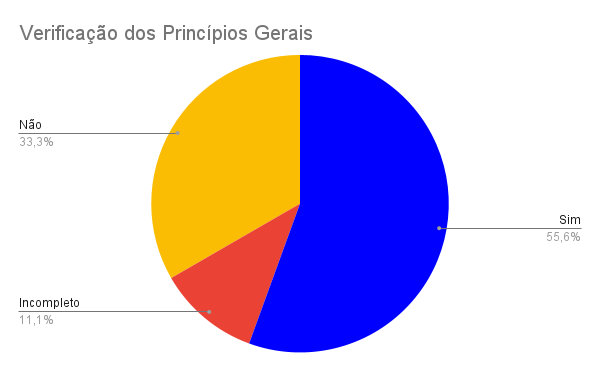
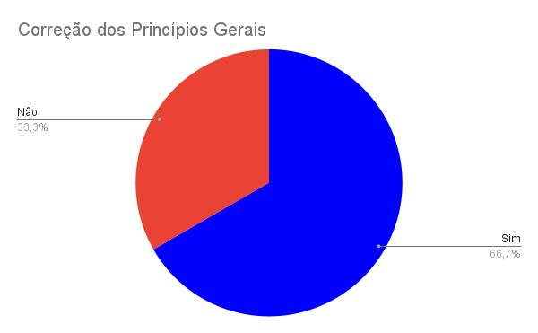

# Princípios Gerais

## Introdução
Segundo a norma internacional ISO/IEC/IEEE 12207:2017(E) (ISO/IEC/IEEE, 2017, p. 82) [1], o objetivo da verificação se define em "prover evidência objetiva que o sistema ou elemento do sistema atende completamente seus requisitos e características especificados". Com isso, a fim de garantir qualidade e consistência dos requisitos, realizaremos a verificação dos documentos do nosso grupo, [OpenStreetMap](https://interacao-humano-computador.github.io/2023.1-OpenStreetMap/)[2], da Interação Humano Computador.

## Objetivos
O objetivo deste documento é realizar a verificação dos Princípios Gerais, artefato da Entrega 2, do Grupo 4 ([OpenStreetMap](https://requisitos-de-software.github.io/2023.1-Caesb/)). De forma impessoal, este documento não deseja avaliar os membros do grupo, mas o artefato em si.

## Metodologia
Como método de investigação e produção da verificação, utilizaremos a inspeção, mais especificamente a _Fagan Inspection_. Na qual, segundo Bush [3], consiste na "inspeção de documentos entendidos como prontos para uso e busca por defeitos". Seguindo as etapas de planejamento, visão geral, preparação, inspeção e correção, e depois realizando o acompanhamento das correções. Maiores detalhes de planejamento, estão apresentados no [Planejamento da Entrega 2](0planejamento.md)

## Verificações anteriores
Durante as aulas das disciplinas de Interação Humano Computador, ministrada pelo professor André Barros, existiu uma atividade de se realizar a verificação dos artefatos de outro grupo, onde o grupo 3 ([Banco Central](https://interacao-humano-computador.github.io/2023.1-BancoCentral/#/)) fez a verificação dos artefatos do grupo 04, onde essa verificação será levada em conta, onde será considerado se algum ponto mencionado faz sentido está presente no checklist, sempre levanto em conta a literatura de referência da disciplina.

## Checklist
Os checklists foram estabelecidos com base nos critérios da literatura o livro interação humano computador[4] e os pontos apontados pelo grupo 3, do [Banco Central](https://interacao-humano-computador.github.io/2023.1-BancoCentral/#/), contendo também algumas perguntas básicas para avaliar a padronização, todas sendo presentes na tabela 1 já preenchida.

| ID| Descrição | Avaliação | Observação |
|:-:|---|:-:|---|
| 1 | O artefato possui uma introdução condizente com o conteúdo do texto? | Sim | Mas está muito longa |
| 2 | Todas as bibliografias/referências bibliográficas são utilizadas de forma correta? | Incompleto | Citação Incorreta. |
| 3 | Todas as tabelas e figuras são chamadas no texto, possuem legendas e fontes? | N/A ||
| 4 | A metodologia está de acordo com o artefato analisado? | Não | Não existe a parte de metodologia. |
| 5 | Os princípios Gerais apresenta as diretrizes de Norman do livro de Interação Humano Computador[4] no capítulo 8? | Sim ||
| 6 | Esses princípios são explicados? | Sim ||
| 7 | É mostrado onde esses princípios se aplicam no site? | Sim ||
| 8 | É mostrado como esses princípios serão utilizados? | Não ||
| 9 | Há figuras que mostrem e comprovem o que foi falado com o respeito ao site? | Não ||
| 10 | Existe justificativa para poder não abordar um princípio geral? | Não ||

Tabela 1 - Checklist dos Princípios Gerais. (Fonte: Autor)

## Gráfico
Com base no checklist feito no processo de inspeção dos Princípios Gerais, foi produzido o gráfico de avaliação do artefato, que pode ser visualizado/analisado na Figura 1.

Figura 1 - Gráfico Princípios Gerais. (Fonte: Autor)

## Correções
O planejamento e a situação da correção dos artefatos dos Princípios Gerais será registrado na Tabela 2.

| ID | Descrição resumida| Detalhes da correção| Responsável pela correção | Revisor | Status |
|:--:|------|------|:---------:|:---:|:--:|
| 2 | Citação está Incorreta | Corrigir citação | [Daniel](https://github.com/daniel-de-sousa) | [Guilherme](https://github.com/guilhermekishimoto) | OK |
| 4 | Sem metodologia | Adicionar Metodologia | [Daniel](https://github.com/daniel-de-sousa) | [Guilherme](https://github.com/guilhermekishimoto) | OK |
| 8 | Não informa como serão uteis | Mostrar quando e como serão usados | [Daniel](https://github.com/daniel-de-sousa) | [Guilherme](https://github.com/guilhermekishimoto) | - |
| 9 | Sem representações do site | Colocar prints do site onde se adequam | [Daniel](https://github.com/daniel-de-sousa) | [Guilherme](https://github.com/guilhermekishimoto) | - |
| 10 | Não há explicação | Explicar o motivo de alguns princípios não aparecerem | [Daniel](https://github.com/daniel-de-sousa) | [Guilherme](https://github.com/guilhermekishimoto) | - |

Tabela 2 - Distribuição da Correção do Artefato (Fonte: Autor)

## Gráfico das Correções
Depois das correções se foi verificado novamente, e o resultado pode ser visto na figura 2.

Figura 2 - Gráfico Princípios Gerais com Correções. (Fonte: Autor)

## Referência bibliográfica

> [1] ISO/IEC/IEEE 12207:2017(E) (ISO/IEC/IEEE, 2017, p. 82). Disponível em: https://www.iso.org/obp/ui/#iso:std:iso-iec-ieee:24765:ed-2:v1:en . Acesso em: 13 jun. 2023

> [2] OPENSTREETMAP, grupo 4. Disponível em https://interacao-humano-computador.github.io/2023.1-OpenStreetMap/. Acesso em: 15 jun. 2023.

> [3] BUSH, Marilyn, Chris Gerrard, Clifford Shelley. Fagan Inspection: The Silver Bullet No-one Wants to Fire. London SPIN, 25 mar. 2010.

> [4] Barbosa, S. D. J.; Silva, B. S. da; Silveira, M. S.; Gasparini, I.; Darin, T.; Barbosa, G. D. J. (2021) Interação Humano-Computador e Experiência do usuário. Autopublicação. ISBN: 978-65-00-19677-1 . Acesso em 19 de jun.2023

## Bibliografia

> Barbosa, S. D. J.; Silva, B. S. da; Silveira, M. S.; Gasparini, I.; Darin, T.; Barbosa, G. D. J. (2021) Interação Humano-Computador e Experiência do usuário. Autopublicação. ISBN: 978-65-00-19677-1 . Acesso em 19 de jun.2023

> SERRANO, Milene, SERRANO, Maurício. Análise de Requisitos (Aula 23). UnB Gama, Brasília, 2023. Disponível no [link](../assets/referencias/Requisitos%20-%20Aula%20023.pdf).

> BANCOCENTRAL, grupo 03. Disponível em https://interacao-humano-computador.github.io/2023.1-BancoCentral/#/ . Acesso em 19 de jun.2023

## Histórico de Versão
|    Data    | Data Prevista de Revisão | Versão |      Descrição       |                                 Autor                                  |               Revisor               |
| :--------: | :----------------------: | :----: | :------------------: | :--------------------------------------------------------------------: | :---------------------------------: |
| 19/06/2023 |        19/06/2023        |  1.0   | Criação do documento |  [Daniel](https://github.com/daniel-de-sousa) | [Guilherme](https://github.com/guilhermekishimoto)  |