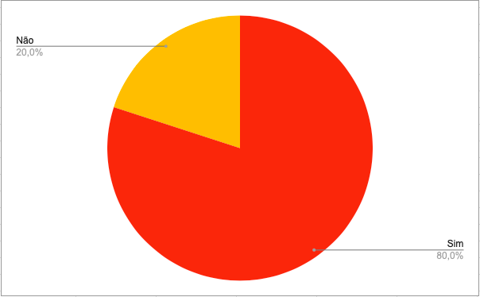

# Planejamento da Verificação da Análise de Tarefas
## Introdução

Conforme a norma internacional ISO/IEC/IEEE 12207:2017(E) (ISO/IEC/IEEE, 2017, p. 82) [1], a finalidade da verificação é "fornecer evidência objetiva de que o sistema ou componente do sistema satisfaz completamente seus requisitos e características especificados". Para assegurar a qualidade e a consistência dos requisitos, iremos verificar os documentos do nosso grupo, [OpenStreetMap](https://interacao-humano-computador.github.io/2023.1-OpenStreetMap/)[2], da disciplina Interação Humano Computador.

## Objetivos
O objetivo deste documento é realizar a verificação do Planejamento da Análise de Tarefas, artefato da Entrega 4, do Grupo 4 ([OpenStreetMap](https://interacao-humano-computador.github.io/2023.1-OpenStreetMap/)). Este documento tem a intenção de avaliar o artefato, não os membros do grupo.

## Metodologia
Para a investigação e produção da verificação, usaremos a inspeção, especificamente a _Fagan Inspection_. Segundo Bush [3], consiste na "inspeção de documentos considerados prontos para uso e busca por defeitos". Seguindo as etapas de planejamento, visão geral, preparação, inspeção e correção. Mais detalhes do planejamento estão apresentados no [Planejamento da Entrega 4](./0planejamento.md).

## Verificações anteriores
Como atividade da disciplina de Interação Humano Computador, ministrada pelo professor André Barros, é realizada a verificação do projeto de outro grupo. A nossa verificação foi feita sobre o Planejamento da Análise de Tarefas do grupo 5 ([Alistamento Militar](https://interacao-humano-computador.github.io/2023.1-OpenStreetMap/Verificacao/grupo5/ponto4/)). E o grupo 3 ([Banco Central](https://interacao-humano-computador.github.io/2023.1-BancoCentral/#/verificacao/ponto_controle_4/plan_aval_st_g4)), inspecionou nosso projeto (OpenStreeMap). 

Reavaliamos nosso checklist com base nos pontos levantados pelo grupo 3 e nas literaturas de referência. Assim, um novo checklist foi criado para a avaliação do nosso próprio guia.

## Checklist

Os checklists foram estabelecidos com base nos critérios do livro Interação Humano-Computador[4], nas verificações realizadas pelo nosso grupo, OpenStreetMap[5], e pelo Grupo 3, Banco Central[6], além das perguntas padrões estabelecidas no [Planejamento Geral](../0planejamento-geral.md). A tabela abaixo apresenta o checklist de verificação da versão 1.0 do artefato do Planejamento da Análise de Tarefas.

| ID | Pergunta                                                                                                                        | Avaliação | Observação |
|----|---------------------------------------------------------------------------------------------------------------------------------|-----------|------------|
| 1  | O artefato possui uma introdução condizente com o conteúdo do texto?                                                           |    Sim       |            |
| 2  | Todas as bibliografias/referências bibliográficas são utilizadas no texto?                                                     |      Sim     |            |
| 3  | Todas as tabelas e figuras são chamadas no texto, possuem legendas e fontes?                                                   |    Sim       |           |
| 4  | As metodologias do texto definem de forma condizente as formas e os métodos que o grupo realizou o artefato?                   |     Sim      |            |
| 5  | O artefato segue o Framework DECIDE?                                                                                            |    Sim       |           |
| 6  | O artefato define claramente as metas e objetivos da avaliação?                                                                 |    Sim       |            |
| 7  | O artefato indica quais métodos de avaliação serão utilizados?                                       |          Sim |           |
| 8  | Os métodos escolhidos para a avaliação são apropriados?                                                                       |     Sim      |            |
| 9  | O artefato considera e aborda questões práticas relevantes para a avaliação?                                                    |      Sim     |            |
| 10 | O artefato informa a quantidade de participantes envolvidos na avaliação e o motivo dessa quantidade?                             |     Não      |          |
| 11 | O perfil dos participantes foi definido?                                                                                        |  Sim         |            |
| 12 | O artefato possui um cronograma com datas, horários e locais das tarefas a serem executadas pelos participantes?                |     Não      |     Não possui cronograma.       |
| 13 | O artefato identifica e descreve as questões específicas que a avaliação das análises de tarefas deve responder?                |     Sim      |            |
| 14 | O artefato apresenta as ferramentas que serão utilizadas na avaliação?                                                                      |    Sim       |            |
| 15 | O artefato contempla considerações éticas importantes relacionadas à avaliação?                                  |      Sim     |            |
| 16 | Foi realizado um teste piloto?                                                                                                  |    Não       |          |
| 17 | O artefato apresenta os resultados obtidos com o teste piloto?                                                                  |    Não       |            |
| 18 | O artefato apresenta quais tarefas serão avaliados?                                                                          |    Sim       |           |
| 19 | O artefato possui a mesma quantidade de tarefas em relação à quantidade de integrantes do grupo?                           |     Sim      |           |
| 20 | O artefato descreve como os dados coletados serão analisados e utilizados?                                                      |     Sim      |            |

A figura 1 abaixo apresenta um gráfico de pizza com o resultado da avaliação do checklist do Planejamento da Análise de Tarefas.

</img>

Figura 1 - Gráfico Checklist Planejamento da Avaliação do Sotryboard (Fonte: Autores)

<!-- INSERIR FIGURA DO GRÁFICO -->

## Correções
Com base na inspeção realizada, passaremos para o processo de correção. Identificaremos os itens a serem corrigidos (ID), forneceremos uma descrição resumida deles (Descrição), além de detalhar a correção a ser feita (Detalhes), definindo os responsáveis (corretor e revisor), a data da correção e o status, usando um "ok" para corrigido e "-" para não corrigido. A tabela abaixo mostra como serão realizados os ajustes no Planejamento da Análise de Tarefas.

<!-- INSERIR TABELA DE CORREÇÕES -->

## Referência bibliográfica

> [1] ISO/IEC/IEEE 12207:2017(E) (ISO/IEC/IEEE, 2017, p. 82). Disponível em: https://www.iso.org/obp/ui/#iso:std:iso-iec-ieee:24765:ed-2:v1:en . Acesso em: 13 jun. 2023

> [2] OPENSTREETMAP, grupo 4. Disponível em https://interacao-humano-computador.github.io/2023.1-OpenStreetMap/. Acesso em: 15 jun. 2023.

> [3] BUSH, Marilyn, Chris Gerrard, Clifford Shelley. Fagan Inspection: The Silver Bullet No-one Wants to Fire. London SPIN, 25 mar. 2010.

> [4] BARBOSA, S. D. J.; SILVA, B. S. Interação Humano-Computador. Rio de Janeiro: Elsevier, 2011. Acesso em 17/06/2023

> [5] KISHIMOTO, Guilherme. Verificação do artefato "Guia de Estilo". Repositório do Grupo OpenStreetMap da disciplina de Interação Humano Computador da Universidade de Brasília, 2023. Disponível em: https://interacao-humano-computador.github.io/2023.1-OpenStreetMap/DesignAvaliação/analisetarefas/planejamento_analise_tarefa/. Acesso em 19/06/2023

> [6] SANTOS, Mizael. Verificação do artefato "Guia de Estilo". Repositório do Grupo Banco Central da disciplina de Interação Humano Computador da Universidade de Brasília, 2023. Disponível em: https://interacao-humano-computador.github.io/2023.1-BancoCentral/#/verificacao/ponto_controle_4/plan_aval_st_g4. Acesso em 19/06/2023

## Histórico de Versão
|    Data    | Data Prevista de Revisão | Versão |      Descrição       |                                 Autor                                  |               Revisor               |
| :--------: | :----------------------: | :----: | :------------------: | :--------------------------------------------------------------------: | :---------------------------------: |
| 19/06/2023 |        19/06/2023        |  1.0   | Criação do documento |  [Guilherme](https://github.com/guilhermekishimoto) | [Paulo]() |