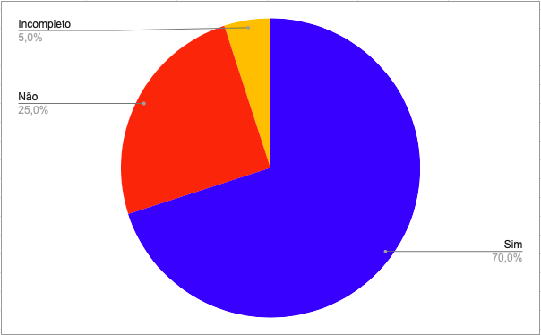
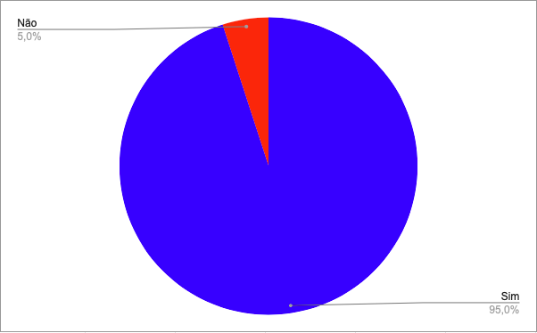

# Planejamento da Avaliação do Sotryboard
## Introdução

Segundo a norma internacional ISO/IEC/IEEE 12207:2017(E) (ISO/IEC/IEEE, 2017, p. 82) [1], o objetivo da verificação se define em "prover evidência objetiva que o sistema ou elemento do sistema atende completamente seus requisitos e características especificados". Com isso, afim de garantir qualidade e consistência dos requisitos, realizaremos a verificação dos documentos do nosso grupo, [OpenStreetMap](https://interacao-humano-computador.github.io/2023.1-OpenStreetMap/)[2], da disciplina Interação Humano Computador.

## Objetivos
O objetivo deste documento é realizar a verificação do Planejamento da avaliação do Storyboard, artefato da Entrega 4, do Grupo 4 ([OpenStreetMap](https://interacao-humano-computador.github.io/2023.1-OpenStreetMap/)). De forma impessoal, este documento não deseja avaliar os membros do grupo, mas o artefato em si.

## Metodologia
Como método de investigação e produção da verificação, utilizaremos a inspeção, mais especificamente a _Fagan Inspection_. Na qual, segundo Bush [3], consiste na "inspeção de documentos entendidos como prontos para uso e busca por defeitos". Seguindo as etapas de planejamento, visão geral, preparação, inspecção e correção. Maiores detalhes de planejamento, estão apresentados no [Planejamento da Entrega 4](./0planejamento.md)

## Verificações anteriores
Uma das atividades da disciplina de Interação Humano Computador, ministrada pelo professor André Barros, é realizar a verificação do projeto de outro grupo. A nossa verificação foi feita sobre o Planejamento da Avaliação do Sotryboard do grupo 5 ([Alistamento Militar](https://interacao-humano-computador.github.io/2023.1-OpenStreetMap/Verificacao/grupo5/ponto4/)). E o grupo 3 ([Banco Central](https://interacao-humano-computador.github.io/2023.1-BancoCentral/#/verificacao/ponto_controle_4/plan_aval_st_g4)), fez a inspeção do nosso projeto (OpenStreeMap). 

Dessa forma, reavaliamos nosso checklist, levando em conta os pontos levantados pelo grupo 3, e baseando-se nas literaturas de referência. Assim, um novo checklist foi criado para a avaliação do nosso próprio guia.

## Checklist
<!-- LIVRO BASE PARA CRIAÇÃO DAS PERGUNTAS -->
Os checklists foram estabelecido com base nos critérios da literatura Interação Humano-Computador[4] e, como citado anteriormente, nas verificações realizadas anteriormente, pelo nosso grupo, OpenStreetMap[5] e pelo Grupo 3, Banco Central[6]. Além das perguntas padrões estabelecidas no [Planejamento Geral](../0planejamento-geral.md). Na tabela 1 abaixo, etá o checklist de verificação da versão 1.0 do artefato do Planejamento da Avaliação do Sotryboard.

<!-- ADICIONAR O CHECKLIST OU OS CHECKLISTS DA ENTREGA REFERENTE -->

| ID | Pergunta                                                                                                                        | Avaliação | Observação |
|----|---------------------------------------------------------------------------------------------------------------------------------|-----------|------------|
| 1  | O artefato possui uma introdução condizente com o conteúdo do texto?                                                           |    Sim       |            |
| 2  | Todas as bibliografias/referências bibliográficas são utilizadas no texto?                                                     |      Não     |    Não são utilizadas no texto.        |
| 3  | Todas as tabelas e figuras são chamadas no texto, possuem legendas e fontes?                                                   |    Sim       |           |
| 4  | As metodologias do texto definem de forma condizente as formas e os métodos que o grupo realizou o artefato?                   |     Sim      |            |
| 5  | O artefato segue o Framework DECIDE?                                                                                            |    Sim       |      O artefato segue a estrutura do DECIDE, mas não explicitamente.      |
| 6  | O artefato define claramente as metas e objetivos da avaliação?                                                                 |    Sim       |            |
| 7  | O artefato indica quais métodos de avaliação serão utilizados para avaliar o storyboard?                                       |          Sim |           |
| 8  | Os métodos escolhidos para a avaliação são apropriados?                                                                       |     Sim      |            |
| 9  | O artefato considera e aborda questões práticas relevantes para a avaliação?                                                    |      Sim     |            |
| 10 | O artefato informa a quantidade de participantes envolvidos na avaliação e o motivo dessa quantidade?                             |     Não      |          |
| 11 | O perfil dos participantes foi definido?                                                                                        |  Sim         |            |
| 12 | O artefato possui um cronograma com datas, horários e locais das tarefas a serem executadas pelos participantes?                |     Sim      |            |
| 13 | O artefato identifica e descreve as questões específicas que a avaliação do storyboard deve responder?                |     Sim      |            |
| 14 | O artefato apresenta as ferramentas que serão utilizadas na avaliação?                                                                      |    Não       |            |
| 15 | O artefato contempla considerações éticas importantes relacionadas à avaliação do storyboard?                                  |      Sim     |      Pode retirar o Termo de Consentimento para Entrevistas e Pesquisas com Usuários e fazer apenas um link para ele.      |
| 16 | Foi realizado um teste piloto?                                                                                                  |    Incompleto       |     Não está com o vídeo.       |
| 17 | O artefato apresenta os resultados obtidos com o teste piloto?                                                                  |    Não       |            |
| 18 | O artefato apresenta quais storyboards serão avaliados?                                                                          |    Sim       |           |
| 19 | O artefato possui a mesma quantidade de storyboards em relação à quantidade de integrantes do grupo?                           |     Não      |     Só possui um Storyboard.       |
| 20 | O artefato descreve como os dados coletados serão analisados e utilizados?                                                      |     Sim      |            |

Tabela 1 - Chacklist Planejamento da Avaliação do Sotryboard (Fonte: Autores)

A figura 1 abaixo mostra um gráfico de pizza com o resultado da avaliação do checklist do Planejamento da Avaliação do Sotryboard.

</img>

Figura 1 - Gráfico Checklist Planejamento da Avaliação do Sotryboard (Fonte: Autores)

## Correções
Com base na inspeção realizada, passaremos para o processo de correção. O qual identificaremos os itens a serem corrigidos (ID), dando uma descrição resumida dele (Descrição), além de dar mais detalhes sobre a correção que deve ser feita (Detalhes), definindo os responsáveis (corretor e revisor), a data da correção e o status, usando um "ok" para corrigido e "-" para não corrigido. A tabela 2, demosntra como realizaremos os ajustes no Planejamento da Avaliação do Sotryboard.

|ID |Descrição resumida|Detalhes da correção|Responsável pela correção|Revisor|Status|
|-------|------|------|---------|---|--|
|2 | Bibliografias/referências bibliográficas não são utilizadas no texto | Mencionar a raferencia bibliografica linkada no próprio texto.      | Guilherme |||
| 5 | O artefato segue o Framework DECIDE, porém pode deixar mais explícito a sua utilização | Deixar mais explícito as etapas do framework DECIDE (colocar o passo, do DECIDE, que está sendo utlizado no título de cada tópico em expecífico).      | Guilherme |||
| 10 | A quantidade de participantes envolvidos na avaliação e o motivo dessa quantidade não estão presentes. | Especificar a quantidade de participantes e o motivo dessa quantidade     | Guilherme |||
| 14 | Não há menção explícita das ferramentas que serão utilizadas na avaliação |  Deixar de forma explícita as ferramentas que serão utilizadas na avaliação.     | Guilherme |||
| 16 | Não está com o vídeo mostrando a realização do teste piloto. | Colocar o vídeo mostrando a realização do teste piloto.      | Guilherme |||
| 17 | O artefato não apresenta os resultados obtidos com o teste piloto | Colocar no artefato o resultado do teste piloto      | Guilherme |||
| 20 | O artefato não possui a mesma quantidade de storyboards em relação à quantidade de integrantes do grupo      | Guilherme |||

Tabela 2 - Distribuição da Correção dos Artefatos (Fonte: Autores)

Abaixo, na tabela 3, encontra-se o checklist feito após a correção do Planejamento da Avaliação do Sotryboard.

<!-- ADICIONAR O CHECKLIST OU OS CHECKLISTS DA ENTREGA REFERENTE -->

| ID | Pergunta                                                                                                                        | Avaliação | Observação |
|----|---------------------------------------------------------------------------------------------------------------------------------|-----------|------------|
| 1  | O artefato possui uma introdução condizente com o conteúdo do texto?                                                           |    Sim       |            |
| 2  | Todas as bibliografias/referências bibliográficas são utilizadas no texto?                                                     |      Sim     |            |
| 3  | Todas as tabelas e figuras são chamadas no texto, possuem legendas e fontes?                                                   |    Sim       |           |
| 4  | As metodologias do texto definem de forma condizente as formas e os métodos que o grupo realizou o artefato?                   |     Sim      |            |
| 5  | O artefato segue o Framework DECIDE?                                                                                            |    Sim       |           |
| 6  | O artefato define claramente as metas e objetivos da avaliação?                                                                 |    Sim       |            |
| 7  | O artefato indica quais métodos de avaliação serão utilizados para avaliar o storyboard?                                       |          Sim |           |
| 8  | Os métodos escolhidos para a avaliação são apropriados?                                                                       |     Sim      |            |
| 9  | O artefato considera e aborda questões práticas relevantes para a avaliação?                                                    |      Sim     |            |
| 10 | O artefato informa a quantidade de participantes envolvidos na avaliação e o motivo dessa quantidade?                             |     Sim      |          |
| 11 | O perfil dos participantes foi definido?                                                                                        |  Sim         |            |
| 12 | O artefato possui um cronograma com datas, horários e locais das tarefas a serem executadas pelos participantes?                |     Sim      |            |
| 13 | O artefato identifica e descreve as questões específicas que a avaliação do storyboard deve responder?                |     Sim      |            |
| 14 | O artefato apresenta as ferramentas que serão utilizadas na avaliação?                                                                      |    Sim       |            |
| 15 | O artefato contempla considerações éticas importantes relacionadas à avaliação do storyboard?                                  |      Sim     |            |
| 16 | Foi realizado um teste piloto?                                                                                                  |    Sim       |          |
| 17 | O artefato apresenta os resultados obtidos com o teste piloto?                                                                  |    Sim       |            |
| 18 | O artefato apresenta quais storyboards serão avaliados?                                                                          |    Sim       |           |
| 19 | O artefato possui a mesma quantidade de storyboards em relação à quantidade de integrantes do grupo?                           |     Não      |           |
| 20 | O artefato descreve como os dados coletados serão analisados e utilizados?                                                      |     Sim      |            |

Tabela 3 - Chacklist Pós Correção do Planejamento da Avaliação do Sotryboard (Fonte: Autores)

A figura 1 abaixo mostra um gráfico de pizza com o resultado da avaliação do checklist do Planejamento da Avaliação do Sotryboard.

</img>

Figura 2 - Gráfico Checklist Pós Correção Planejamento da Avaliação do Sotryboard (Fonte: Autores)

## Referência bibliográfica

> [1] ISO/IEC/IEEE 12207:2017(E) (ISO/IEC/IEEE, 2017, p. 82). Disponível em: https://www.iso.org/obp/ui/#iso:std:iso-iec-ieee:24765:ed-2:v1:en . Acesso em: 13 jun. 2023

> [2] OPENSTREETMAP, grupo 4. Disponível em https://interacao-humano-computador.github.io/2023.1-OpenStreetMap/. Acesso em: 15 jun. 2023.

> [3] BUSH, Marilyn, Chris Gerrard, Clifford Shelley. Fagan Inspection: The Silver Bullet No-one Wants to Fire. London SPIN, 25 mar. 2010.

> [4] BARBOSA, S. D. J.; SILVA, B. S. Interação Humano-Computador. Rio de Janeiro: Elsevier, 2011. Acesso em 17/06/2023

> [5] KISHIMOTO, Guilherme. Verificação do artefato "Planejamento da Avaliação do Sotryboard". Repositório do Grupo OpenStreetMap da disciplina de Interação Humano Computador da Universidade de Brasília, 2023. Disponível em: https://interacao-humano-computador.github.io/2023.1-OpenStreetMap/DesignAvaliação/storyboard/planejamento_storyboard/. Acesso em 19/06/2023

> [6] SANTOS, Mizael. Verificação do artefato "Guia de Estilo". Repositório do Grupo Banco Central da disciplina de Interação Humano Computador da Universidade de Brasília, 2023. Disponível em: https://interacao-humano-computador.github.io/2023.1-BancoCentral/#/verificacao/ponto_controle_4/plan_aval_st_g4. Acesso em 19/06/2023

## Histórico de Versão
|    Data    | Data Prevista de Revisão | Versão |      Descrição       |                                 Autor                                  |               Revisor               |
| :--------: | :----------------------: | :----: | :------------------: | :--------------------------------------------------------------------: | :---------------------------------: |
| 19/06/2023 |        19/06/2023        |  1.0   | Criação do documento |  [Guilherme](https://github.com/guilhermekishimoto) | [Paulo]() |

